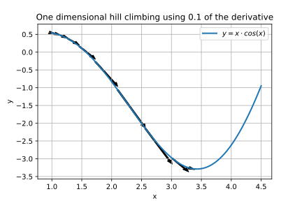
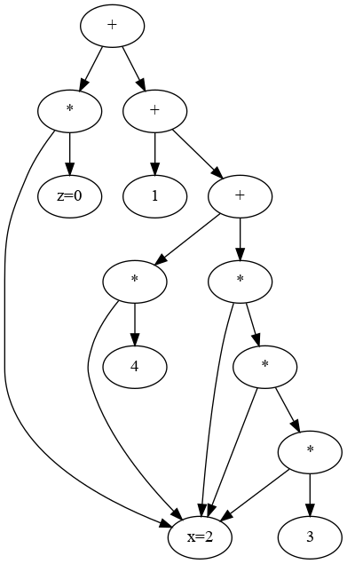
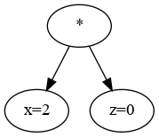
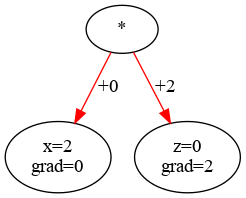
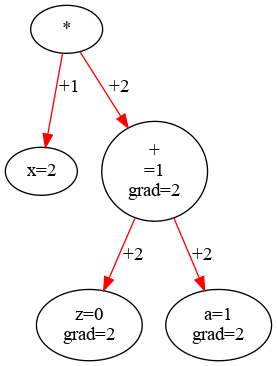
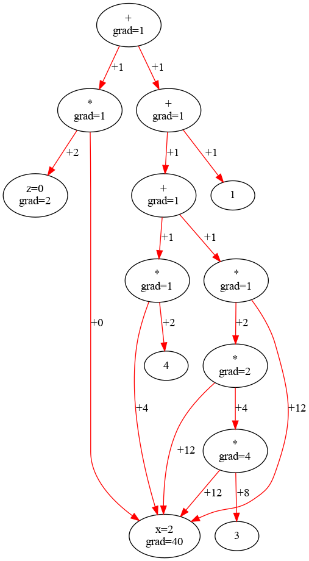

> This page is part of the [Hello Deep Learning](../hello-deep-learning) series of blog posts. You are very welcome to improve this page [via GitHub](https://github.com/berthubert/hello-dl-posts/blob/main/autograd/index.md)!

In the previous chapter we configured a neural network and made it learn to distinguish between the digits 3 and 7. The learning turned out to consist of "twisting the knobs in the right direction". Although simplistic, the results were pretty impressive. But, you might still be a bit underwhelmed - the network only distinguished between two digits.

To whelm it up a somewhat, in this chapter we'll introduce a 5 layer network that can learn to recognize all 10 handwritten digits with near perfect accuracy. But before we can make it learn, we need to move slightly beyond the "just twist the parameters in the right direction" algorithm.

The first part of this chapter covers the theory, and shows no code. The second part explains the code that makes it all happen. You can skip or skim the second part if you want to focus on the ideas.

## The basics
Our previous network consisted of one layer, a linear combination of input pixels. Here is a **preview** of the layers that achieve 98% accuracy recognizing handwritten digits:

1. Flatten 28x28 image to a 784x1 matrix
2. Multiply this matrix by a 128x784 matrix 
3. Replace all negative elements of the resulting matrix by 0
4. Multiply the resulting matrix by a 64x128 matrix 
5. Replace all negative elements of the resulting matrix by 0
6. Multiply the resulting matrix by a 10x64 matrix
7. Pick the highest row of the resulting 10x1 matrix, this is the digit the network thinks it saw

This model involves three matrices of parameters, with in total 128\*784 + 64\*128 + 10\*64 = 109184 *weights*. There are also 128+64+10 = 202 *bias* parameters.

We'll dive into this network in detail later, but for now, ponder how we'd train this thing. If the output of this model is not right, by how much should we adjust each parameter? For the one-layer model from the previous chapter this was trivial - the connection between input image intensity and a weight was clear. But here?

## Turning the knobs, or, hill climbing
In our previous model, we took the formula:

R=p_1w_1 + p_2w_2 + \cdots + p_{783}w_{783} + p_{784}w_{784}

And we then performed 'learning' by increasing the w_n parameters by 0.1 of their associated p_n. Effectively, we took the *derivative* of w_n, multiplied it by 0.1, and added it to w_n.

This is what is called 'hill climbing', and it looks like this:

<center>

  
*Actually hill descending in this case*
<p></p>

</center>

This is a one-dimensional example, and it is very successful: it quickly found the minimum of the function. Such hill climbing has a tendency of getting stuck in local optima, but in neural networks this apparently is far less of a problem. This may be because we aren't optimizing over 1 axis, we are actually optimizing over 109184 parameters (in the digit reading network described above). It probably takes quite a lot of work to create a 109184-dimensional local minimum.

So, to learn this way, we need to perform all the calculations in the neural network, look at the outcome, and see if it needs to go up or down. Then we need to find the derivative of the outcome versus all parameters. And then we move all parameters by 0.1 of that derivative (the 'learning rate'). 

This really is all there is to it, but we are now left with the problem how to determine all these derivatives. Luckily this is a well solved problem, and the solution is quite magical. And it is good that this is so, because there are models with hundreds of billions of parameters. Those derivatives should be simple and cheap.

# Automatic differentiation
So, unlike integration, differentiation is actually very straightforward. And it turns out that with relatively little trouble you can get a computer to do it for you. If we for example have:

y = 2x^3 + 4x^2 + 3x + 2 

It is trivial (even for a computer) to turn this into:

\frac{dy}{dx} = 6x^2 + 8x + 3 

And even if we make life more complex, the rules remain simple:

y = \sin{(2x^3 + 4x^2 + 3x + 2)} 
\frac{dy}{dx} = (6x^2+8x+3) \cos{(2x^3 + 4x^2 + 3x + 2)}

This is the '[chain rule](https://en.wikipedia.org/wiki/Chain_rule)', which effectively says the derivative of a compound function is the derivative of that function multiplied by the derivative of the input function. 

I don't want to flood you with too much math, but [automatic differentiation](https://en.wikipedia.org/wiki/Automatic_differentiation) is at the absolute core of neural networks, so it pays to understand what is going on.

# "Autograd"
Every neural network system (PyTorch, TensorFlow, [Flashlight](https://github.com/flashlight/flashlight)) implements an autogradient system that performs automatic differentiation. Such systems can be implemented easily in any programming language that supports operator overloading and reference counted objects. And in fact, the implementation is so easy that you sometimes barely see it. A great example of this is [Andrej Karpathy](https://twitter.com/karpathy)'s [micrograd](https://github.com/karpathy/micrograd) autogradient implementation, [which is a tiny work of art](https://github.com/karpathy/micrograd/blob/master/micrograd/engine.py).

First, let's look at what such a system can do:

```C++
Tensor x(2.0f);
Tensor z(0.0f);
Tensor y = Tensor(3.0f)*x*x*x + Tensor(4.0f)*x + Tensor(1.0f) + x*z;
```

This configures y to be 3x^3 + 4x + 1 +xz. The notation is somewhat clunky - it is possible to make a library that automatically converts naked numbers into `Tensor`s, but such a library might also surprise you one day when it does so when you don't expect it.

Next up, let's do something:

```C++
cout << "y = "<< y << endl; // 3*8 + 4*2 + 1 = 33
  
y.backward();

cout << "dy/dx = " << x.getGrad() << endl; // 9*x^2 + 4 = 40
cout << "dy/dz = " << z.getGrad() << endl; // 2
```

This prints out the expected outputs, which is nice. The first line perhaps appears to only print out the value of `y`, but as is customary in these systems, the calculation only happens once you try to get the value. In other words, this is lazy evaluation. This can sometimes confuse you when you setup a huge calculation that appears to happen in 'no time'. And this is because the actual calculation hasn't happened yet.

The last line of the initial snippet of code (`Tensor y =`...) actually created a little computer program that will create the right output once run. This little computer program takes the shape of a [directed acyclic graph](https://en.wikipedia.org/wiki/Directed_acyclic_graph):

<center> 

  
y = 3x^3 + 4x + 1 +xz

<p></p>
</center>

Our interest in this case is to determine dy/dx. But first let's look at a very simple case, y = xz:

<center> 

  
y = xz

<p></p>
</center>

Here it is obvious that dy/dx=z=0. Meanwhile, dy/dz=x=2. So if we look at the directed acyclic graph (DAG), if we want to calculate the gradient or differential, each node gets the value of the opposite node:

<center> 

  
*Red lines denote 'sending the gradient'. The right node received the value of the left node as its gradient, and vice versa*

<p></p>
</center>

For a slightly more complicated example:
<center> 

  
y = x(z+a)

<p></p>
</center>

Here we see that the gradients 'drop down' the tree and add up to the correct values. 
dy/dx =1, because z+a=1. Meanwhile, both
dy/da and dy/dz are 2, because x=2.

Now for our full calculation:
<center> 

  
y = 3x^3 + 4x + 1 +xz

<p></p>
</center>

<!-- 
digraph {
"0x55beda3b9100" -> "0x55beda3b8fd0" [label="+1" color="red"]
"0x55beda3b9100" -> "0x55beda3b8370" [label="+1" color="red"]
"0x55beda3b9100" [label="+\ngrad=1"]
"0x55beda3b8370" [label="*\ngrad=1"]
"0x55beda3b8370" -> "0x55beda3b7ec0" [label="+0" color="red"]
"0x55beda3b8370" -> "0x55beda3b8080" [label="+2" color="red"]
"0x55beda3b8fd0" -> "0x55beda3b8ea0" [label="+1" color="red"]
"0x55beda3b8fd0" -> "0x55beda3b8240" [label="+1" color="red"]
"0x55beda3b8fd0" [label="+\ngrad=1"]
"0x55beda3b8ea0" -> "0x55beda3b8d70" [label="+1" color="red"]
"0x55beda3b8ea0" -> "0x55beda3b8820" [label="+1" color="red"]
"0x55beda3b8ea0" [label="+\ngrad=1"]
"0x55beda3b8820" [label="*\ngrad=1"]
"0x55beda3b8820" -> "0x55beda3b8530" [label="+2" color="red"]
"0x55beda3b8820" -> "0x55beda3b7ec0" [label="+4" color="red"]
"0x55beda3b8d70" [label="*\ngrad=1"]
"0x55beda3b8d70" -> "0x55beda3b8c40" [label="+2" color="red"]
"0x55beda3b8d70" -> "0x55beda3b7ec0" [label="+12" color="red"]
"0x55beda3b8c40" [label="*\ngrad=2"]
"0x55beda3b8c40" -> "0x55beda3b8b10" [label="+4" color="red"]
"0x55beda3b8c40" -> "0x55beda3b7ec0" [label="+12" color="red"]
"0x55beda3b8b10" [label="*\ngrad=4"]
"0x55beda3b8b10" -> "0x55beda3b86f0" [label="+8" color="red"]
"0x55beda3b8b10" -> "0x55beda3b7ec0" [label="+12" color="red"]

"0x55beda3b86f0" [label="3"]
"0x55beda3b7ec0" [label="x=2\ngrad=40"]
"0x55beda3b8530" [label="4"]
"0x55beda3b8240" [label="1"]
"0x55beda3b8080" [label="z=0\ngrad=2"]
}

-->
And this indeed arrives at the right numbers. To perform the actual calculation, we visit each node *once*, starting at the top, and *push down* the accumulated gradient to the child nodes.

Now, in a demonstration why a computer science education is useful (I missed out sadly), it turns out that doing such a traversal is a well solved problem. Using an elegant algorithm, a directed acyclic graph can be [sorted topologically](https://en.wikipedia.org/wiki/Topological_sorting). And in this order, we can visit each node once and in the right order to promulgate the accumulated gradients downward.

The elegant algorithm is so elegant you might miss it in the code. It goes like this:

1. Start at the top node
2. If a node has been visited already, return. Otherwise, add node to *visited* set
3. Visit all child nodes (ie, start at step 1 again for each node)
4. Add ourselves at the end of the topographical list of nodes

In this way, we can see that the leaf nodes are the first to be added. The top node only gets added last, because adding to the topographical list only happens once all child nodes are done. Meanwhile the *visited* set makes sure we do the process just once per node.

To distribute the gradients for automatic integration, the topological list is processed in reverse order, which means that we start at the top.

Automatic differentiation can be used for many other things, and need not stop at first derivatives. [ADOL-C](https://github.com/coin-or/ADOL-C) is an interesting library in this respect.

Any time you ask ChatGPT a question, know there is a DAG containing 175 billion parameters that is processing your every word, and that it got taught what it can do by the exact autogradient process described on this page.

# The code
The key concept is that by typing in formulas, we get our computer to build the DAG for us. Because otherwise it would be undoable. Any language that features operator overloading enables us to make this happen rather easily. This is a great example of "letting the ball do the work". By defining addition, multiplication operators that don't actually perform those calculations, but instead populate a DAG that eventually will, we get a ton of functionality for free.

We need a bit more than operator overloading though. We also need objects that stay alive, either by being reference counted, or by surviving garbage collection. 

As an example:

```C++
Tensor x(2.0f);
Tensor z(0.0f);
Tensor y = Tensor(3.0f)*x*x*x + Tensor(4.0f)*x + Tensor(1.0f) + x*z;
```
The values 3.0, 4.0 and 1.0 are all temporaries. These instances vanish from existence by the time the final line is done executing. Yet, they must still find a place in the DAG.

For this reason, a language like C++ needs to create reference counted copies. Python and other pass-by-reference languages with garbage collection may get this for free.

The `Tensor` class in this series of blog posts works like this:

```C++
template<typename T=float>
struct Tensor
{
  typedef Tensor<T> us_t;
  Tensor() : d_imp(std::make_shared<TensorImp<T>>())
  {}

  Tensor(unsigned int rows, unsigned int cols) : d_imp(std::make_shared<TensorImp<T>>(rows, cols))
  {}

  // ...
  std::shared_ptr<TensorImp<T>> d_imp;
};

```
There are many other methods, but this is the key - there is an actual reference counted `TensorImp<T>` behind this. The class is templatized, defaulting to float. Amazingly enough, machine learning has such an effect on hardware that it is triggering innovations like 16 bit floats!

To actually do anything with these `Tensor`s, there are overloaded operators:

```C++
template<typename T>
inline Tensor<T> operator+(const Tensor<T>& lhs, const Tensor<T>& rhs)
{
  Tensor<T> ret;
  ret.d_imp = std::make_shared<TensorImp<T>>(lhs.d_imp, rhs.d_imp, TMode::Addition);
  return ret;
}
```
With this, you can do `Tensor z = x + w`, and `z` will end up containing a `TensorImp` containing reference counted references to `x` and `w`.

Which looks like this:

```C++
template<typename T=float>
struct TensorImp
{
  typedef TensorImp<T> us_t;

  //! Create a new parameter (value) tensor. Inits everything to zero.
  TensorImp(unsigned int rows, unsigned int cols) :  d_mode(TMode::Parameter)
  {
    d_val = Eigen::MatrixX<T>(rows, cols);
    d_grads = Eigen::MatrixX<T>(rows, cols);
    d_grads.setZero();
    d_val.setZero();
    d_haveval = true;
  }

  TensorImp(std::shared_ptr<us_t> lhs, std::shared_ptr<us_t> rhs, TMode m) : 
  d_lhs(lhs), d_rhs(rhs), d_mode(m)
  {
  }
  ... 
  std::shared_ptr<us_t> d_lhs, d_rhs;
  TMode d_mode;
}
```
Here we see a few notable things. For one, we see Eigen crop up. Eigen is a matrix library used by many machine learning projects (including TensorFlow and PyTorch). You might initially think you could do your own matrix library, but this is not the case. The Eigen matrix multiplications for example are over 300 times faster than my hand rolled previous attempts. 

We also see `d_lhs` and `d_rhs`, these are the embedded references to binary operators like '+', '-', '\*' etc. It is these references that allow us to build a directed acyclic graph that contains instructions how to calculate the outcome of the calculation.

Here's an abbreviated version of how that works:
```C++
void assureValue(const TensorImp<T>* caller=0) const
{
  if(d_haveval || d_mode == TMode::Parameter)
    return;

  if(d_mode == TMode::Addition) {
    d_lhs->assureValue(this);
    d_rhs->assureValue(this);
    d_val.noalias() = d_lhs->d_val + d_rhs->d_val;
  }
  else if(d_mode == TMode::Mult) {
    d_lhs->assureValue(this);
    d_rhs->assureValue(this);
    d_val.noalias() = d_lhs->d_val * d_rhs->d_val;
  }
  ...
}
```
Nodes can contain a value that was calculated earlier, in which case `d_haveval` is set. And if needed, `assureValue` is called in turn on child nodes. 

'Calculating the outcome' is what is called the 'forward pass' in neural networks. The automatic differentiation meanwhile is calculated in the opposite direction. Here is where we get all the nodes in topological (reverse) order:

```C++
void build_topo(std::unordered_set<TensorImp<T>*>& visited, std::vector<TensorImp<T>*>& topo)
{ 
  if(visited.count(this))
    return;
  visited.insert(this);
  
  if(d_lhs) {
    d_lhs->build_topo(visited, topo);
  }
  if(d_rhs) {
    d_rhs->build_topo(visited, topo);
  }
  topo.push_back(this);
}
```

As noted above, you could easily miss the magic behind this. 

Once we have this topographic ordering, the distributing of the gradients downwards is simple:

```C++
    d_imp->d_grads.setConstant(1.0);
    for(auto iter = topo.rbegin(); iter != topo.rend(); ++iter) {
      (*iter)->doGrad();
    }
```

The first line is important, the gradient always starts with 1. Note the `rbegin()` and `rend()` which means we traverse the topography in reverse order.

The abbreviated `doGrad()` meanwhile looks like this:

```C++
void doGrad()
{
  if(d_mode == TMode::Parameter) {
    return;
  }
  else if(d_mode == TMode::Addition) {
    d_lhs->d_grads += d_grads;
    d_rhs->d_grads += d_grads;
  }
  else if(d_mode == TMode::Mult) {
    d_lhs->d_grads.noalias() += (d_grads * d_rhs->d_val.transpose());
    d_rhs->d_grads.noalias() += (d_lhs->d_val.transpose() * d_grads);
  }
  ...
```

If a node it just a number (`Tmode::Parameter`) it has no gradient to distribute further. It a node represents an addition, the gradient gets passed on verbatim to both the left hand and right hand sides of the + operator.

For the multiplication case, we see that the left hand side indeed gets a gradient delivered that is proportional to the right hand side, and vice-versa. The delivered gradient is also proportional to the gradient that has already been passed down to this node.

The calls to `.transpose()` meanwhile reflect that our Tensor class is actually a matrix. So far we've been multiplying only 1x1 Tensors, which act just like numbers. In reality this class is used to multiply pretty large matrices. 

Rounding it off - automatic differentiation is absolute key to neural networks. That we can assemble networks of many many layers each consisting of huge matrices using a straightforward syntax makes it possible to innovate rapidly. We are lucky enough that modern languages make it possible to both assemble these networks easily, AND perform automatic differentiation.

[In the next chapter](../handwritten-digits-sgd-batches/) we'll be making our multi-layer network do some actual work in learning to recognize 10 different digits. There we'll also be introducing key concepts in machine learning like loss function, batches and the enigmatic 'softlogmax' layer.


