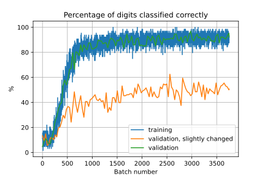

> This page is part of the [Hello Deep Learning](../hello-deep-learning) series of blog posts.

In the [previous chapter](../autograd) we taught a network of linear combinations and 'rectified linear units' to recognize handwritten digits reasonably successfully. But we already noted that the network would be sensitive to the exact location of pixels, and that it does not in any meaningful way "know" what a 7 looks like.

In this chapter we're going to explore convolutional layers that can scan for shapes and make decisions based on their relative positions. And, we'll go over the design over a convolutional neural network that is quite successful at reading not just handwritten digits, but can do handwritten letters.

# Neural network disappointment 
A recurring theme in machine learning is if the network is 'overfitting', where it is not really learning things as we'd hope, but is instead simply memorising stuff. 'Rote learning' if you will. This is in fact a constant battle, and many of the very public machine learning failures, as for example [during the COVID-19 pandemic](https://www.technologyreview.com/2021/07/30/1030329/machine-learning-ai-failed-covid-hospital-diagnosis-pandemic/), are due to networks latching on to the wrong things, or not having generalized the knowledge as broadly as we'd been assuming.

If you take away one thing from this series of posts, please let it be that production use of a neural network tends to go through these four phases (if you are lucky):

1. It works on the training data
2. It also works on the validation data
3. After a lot of disappointment, we get it to work on other people's real life data too
4. Other people can get it to work on their own data as well

Almost all demos declare victory after phase 2. This tutorial aims to achieve the final phase.

To prove this point, here is a graph showing the validation success of our previous network with only slightly modified inputs:

<center>



<p></p>
</center>

Here the input was shifted around by 2 pixels, and 5 random pixels were flicked. No human would be phazed in the least by these changes, but our network performance does drop to around 50%, which is pretty disappointing.

Clearly we need better things than just multiplying whole images and matrices. These things out turn out to be 'convolutional' operations, 'max-pooling' and 'gelu'.

# Convolutional networks
Also known as [CNN, or ConvNet](https://en.wikipedia.org/wiki/Convolutional_neural_network), these may have been the first neural networks that saw bona fide production use. This video by [Yann LeCun](https://en.wikipedia.org/wiki/Yann_LeCun) on [YouTube from 1989](https://www.youtube.com/watch?v=FwFduRA_L6Q) is absolutely worth your while ([associated paper](http://yann.lecun.com/exdb/publis/pdf/lecun-89e.pdf)), especially since we're going to build a network here that is a lot like the one demonstrated there. 

Our previous work took a whole image as input to the network, where the position of pixels really mattered. A convolution is a matrix operation that *slides* over its input. In this way it can scan for features. What it slides over its input is a set of matrices called kernels, typically quite small. Each kernel is multiplied per element over the part of the input it lies on. The output is the sum of all these multiplications:
 

<style>
text { font-family: monospace; }
</style>


<!-- text {font-size: 0.8em !important; } -->

```goat
       input layer           kernel        output layer
+--+--+--+--+--+--+--+--+  +--+--+--+  +--+--+--+--+--+--+
|1 |2 |3 |4 |5 |6 |7 |8 |  |1 |2 |3 |  |A |..|..|..|..|..|
+--+--+--+--+--+--+--+--+  +--+--+--+  +--+--+--+--+--+--+
|9 |10|11|12|13|14|15|16|  |4 |5 |6 |  |..|B |..|..|..|..|
+--+--+--+--+--+--+--+--+  +--+--+--+  +--+--+--+--+--+--+
|17|18|19|20|21|22|23|24|  |7 |8 |9 |  |..|..|..|..|..|C | 
+--+--+--+--+--+--+--+--+  +--+--+--+  +--+--+--+--+--+--+ 
|25|26|27|28|29|30|31|32|              |..|..|..|..|..|..| 
+--+--+--+--+--+--+--+--+              +--+--+--+--+--+--+ 
|33|34|35|36|37|38|39|40|
+--+--+--+--+--+--+--+--+ 
|41|42|43|44|45|46|47|48|
+--+--+--+--+--+--+--+--+
```

Here three sample positions A, B and C in the output layer:
```
A =  1*1 +  2*2 +  3*3 +  9*4 + 10*5 + 11*6 + 17*7 + 18*8 + 19*9  
B = 10*1 + 11*2 + 12*3 + 18*4 + 19*5 + 20*6 + 26*7 + 27*8 + 28*9  
C = 22*2 + 23*2 + 24*3 + 30*4 + 31*5 + 32*6 + 38*7 + 39*8 + 40*9  
```

Note that the output differs in dimensions from the input. If the input had R rows and a K by K kernel is used, the output will have 1+R-K rows, and similar for columns (1+C-K). The output dimensions will always be smaller. The values in the output represent the presence of features matched by the filter kernels.

Typically, many kernels are used, leading to a single input layer creating many output layers. Every kernel is associated with a single output layer. Conceptually this can be seen as a convolutional layer scanning for many different kinds of features, all at the same time.

XXX https://medium.com/mlearning-ai/simple-explanation-for-calculating-the-number-of-parameters-in-convolutional-neural-network-33ce0fffb80c

A convolutional network can also accept multiple input layers at the same time. In this case, every output kernel slides over every input channel, and the output is the sum of the sums of that kernel sliding over all input channels. This means the number of operations is proportional to the product of the number of output layers and the number of input layers. Quite soon we are talking billions of operations. The number of filter parameters scales with product of the number of input and output layers, and of course the kernel size.

Convolutional networks do not use a lot of parameters (since kernels tend to be small), but they simply *burn* through CPU cycles. Because they do not access a lot of memory, parallel processing can speed things up tremendously though.

Chapter 7 from "Dive into Deep Learning" [has a good and more expansive explanation](https://d2l.ai/chapter_convolutional-neural-networks/index.html), and it may do a better job than this page.

# Max-pooling
We use convolutional layers to detect features, but we don't care that much about the exact position of a feature. In fact we may often not even want to know - the network might start to depend on it. Because of this, the output of a convolutional layer is often fed through a 'max-pool'.

This is a simple operation that slides over an input matrix, but has no kernel parameters. But it does have a size, often 2 by 2. The output is the maximum value within that window. 

Unlike a convolutional layer, max-pooling uses non-overlapping windows. So if a 2x2 window is used, the output channels have half the number of rows and columns compared to the input channels.

The essence of this is that if a feature is detected anywhere within a 2x2 window, it generates the same output independent of its position on any of the four pixels. Also, the number of outputs is divided by 4, which is useful for limiting the size of the network.

> Note: Pools can of course have other sizes. Also, when two-dimensional pools are used, you'll often see them described as 'max2d'.

# GELU
Recall how we used the 'Rectified linear unit' (RELU) to replace all negative values by zero (and leaving the rest alone). This introduces a non-linearity between matrix operations, which in turn means the network turns into something more than a simple linear combination of elements.

Various neural networks have been experimenting, and it has been noted that RELU throws away a lot of information for negative values. It appears that using a different activation function can help a lot. Popular these days is GELU, Gaussian Error Linear Unit, which is not linear nor is it an error. And also not that Gaussian actually.

<center>


<p></p>

</center>

More details can be found in [Gaussian Error Linear Units (GELUs)](https://arxiv.org/abs/1606.08415), and there is some more depth in [Avoiding Kernel Fixed Points:
Computing with ELU and GELU Infinite Networks](https://ojs.aaai.org/index.php/AAAI/article/view/17197/17004).

After having read the literature, I'm afraid I'm left [with the impression that GELU tends to do better](https://arxiv.org/pdf/2002.05202.pdf), but that we're not that sure why. For what it's worth, the code we're developing here confirms this impression.

# The whole design
Here is the complete design of our neural network that we're going to use to recognize handwritten (print) letters:

1. The input is again a 28x28 image, not flattened
2. A 3x3 kernel convolutional layer with 1 input layer and 32 output layers
3. Max2d layer, 2x2
4. GELU activation 
5. A 3x3 kernel convolutional layer, 13x13 input dimensions, 32 input layers, 64 output layers
6. Max2d layer, 2x2
7. GELU activation 
8. A 3x3 kernel convolutional layer, 6x6 input dimensions, 64 input layers, 128 output layers
6. Max2d layer, 2x2
7. GELU activation 
8. Flatten all these 128 2x2 layers to 512*1 matrix
9. First linear combination
11. GELU activation
12. Second linear combination
13. GELU activation
14. Third linear combination, down to 26x1
15. LogSoftMax

This looks like a lot, but if you look carefully, steps 2/3/4, 5/6/7, 8/9/10 are three times the same thing.

Expressed as code it may even be easier to follow:
```C++
using ActFunc = GeluFunc;

auto step1 = s.c1.forward(img);    // -> 26x26, 32 layers
auto step2 = Max2dfw(step1, 2);    // -> 13x13
auto step3 = s.c2.forward(step2);  // -> 11x11, 64 layers
auto step4 = Max2dfw(step3, 2);    // -> 6x6 (padding)
auto step5 = s.c3.forward(step4);  // -> 4x4, 128 layers
auto step6 = Max2dfw(step5, 2);    // -> 2x2
auto flat = makeFlatten(step6);    // -> 512x1
auto output = s.fc1.forward(flat); // -> 64
auto output2 = makeFunction<ActFunc>(output);
auto output3 = makeFunction<ActFunc>(s.fc2.forward(output2)); // -> 128
auto output4 = makeFunction<ActFunc>(s.fc3.forward(output3)); // -> 26
scores = makeLogSoftMax(output4);
modelloss = -(expected*scores).sum();
```

It is somewhat astounding that these few lines will learn to read handwritten characters.

Visually:

```goat
       input layer         
+--+--+--+--+--+--+--+--+  
| 1|  |  |  |  |  |  |28|            32 x
+--+--+--+--+--+--+--+--+    +--+--+--+--+--+--+          64 x
|  |  |  |  |  |  |  |  |    | 1|  |  |  |  |13|    +--+--+--+--+     128 x
+--+--+--+--+--+--+--+--+    +--+--+--+--+--+--+    | 1|  |  | 6|    +--+--+
|  |  |  |  |  |  |  |  |    |  |  |  |  |  |  |    +--+--+--+--+    | 1| 2|
+--+--+--+--+--+--+--+--+ -> +--+--+--+--+--+--+ -> |  |  |  |  | -> +--+--+
|  |  |  |  |  |  |  |  |    |  |  |  |  |  |  |    +--+--+--+--+    | 2| 2|
+--+--+--+--+--+--+--+--+    +--+--+--+--+--+--+    | 6|  |  | 6|    +--+--+
|  |  |  |  |  |  |  |  |    |13|  |  |  |  |13|    +--+--+--+--+    
+--+--+--+--+--+--+--+--+    +--+--+--+--+--+--+                        
|28|  |  |  |  |  |  |28|                                           
+--+--+--+--+--+--+--+--+                                           
```                                                                 

These are the three convolutions and "Max2d" combinations. We end up with 128 layers of four values each. These are flattened into a 512x1 matrix, 
which then undergoes further multiplications:

```goat
                               +---+--+--+--+                         
                               |  1|  |  |64|
                               +---+--+--+--+          
                               |   |  |  |  |
                               +---+--+--+--+                              +---+--+--+--+--+--+---+   
                               |   |  |  |  |                              |  1|  |  |  |  |  |128|   
                               +---+--+--+--+                              +---+--+--+--+--+--+---+   
                               |   |  |  |  |                              |   |  |  |  |  |  |   |   
                               +---+--+--+--+                              +---+--+--+--+--+--+---+   
                               |   |  |  |  |                              |   |  |  |  |  |  |   |   
                               +---+--+--+--+                              +---+--+--+--+--+--+---+   
                               |512|  |  |  |                              | 64|  |  |  |  |  |   |   
                            x  +---+--+--+--+                           x  +---+--+--+--+--+--+---+   

+--+--+--+--+--+--+--+---+     +---+--+--+--+            +---+--+--+--+    +---+--+--+--+--+--+---+   
| 1|  |  |  |  |  |  |512|  =  |  1|  |  |64| -> GELU -> |  1|  |  |64| =  |  1|  |  |  |  |  |128|   
+--+--+--+--+--+--+--+---+     +---+--+--+--+            +---+--+--+--+    +---+--+--+--+--+--+---+   

                             
                                        +---+--+--+--+
                                        |  1|  |  |26|
                                        +---+--+--+--+
                                        |   |  |  |  |
                                        +---+--+--+--+
                                        |   |  |  |  |
                                        +---+--+--+--+
                                        |   |  |  |  |
                                        +---+--+--+--+
                                        |   |  |  |  |
                                        +---+--+--+--+
                                        |128|  |  |  |
                                        +---+--+--+--+

                                     x
           +---+--+--+--+--+--+---+     +---+--+--+--+
-> GELU -> |  1|  |  |  |  |  |128|  =  |  1|  |  |26| -> SoftLogMax
           +---+--+--+--+--+--+---+     +---+--+--+--+
```

And this last matrix, 26 wide, gives us the scores for each possible character.

# So where did this design come from?
I copied it from [here](https://data-flair.training/blogs/handwritten-character-recognition-neural-network/). As we'll discuss in [the next chapter](hyperparameters-inspection-adam), neural network demos and tutorials tend to make their designs appear out of thin air. In reality, designing a good neural network is a lot of hard work. What you are seeing in a demo is the outcome of an (undisclosed) search over many possibilities. If you want to learn the ropes, it is best to first copy something that is known to work. And even then you'll often find that it doesn't work as well for you as it it did in the demo.

# Let's fire it up!
Whereas previous test programs did their learning in seconds or minutes, teaching this network to learn to recognize letters takes *ages*. As in, most of a day:
<center>


<p></p>
</center>

So a few things to note - even after 24 hours of training the network was only 85% correct or so. If you look at the failures however, quite a lot of the input is in fact subjective. The difference between a handwritten *g* and a handwritten *q* is not that obvious without context. If we count the "second best guess" as almost correct, the network scores over 95% correct or almost correct, which is not too bad.

Here is a sample of the input the network has to deal with:
<center>


<p></p>
</center>

And here is the confusion matrix, where you can see that besides *g* and *q*, distinguishing *i* and *l* is hard, as well as *h* and *n*:
<center>


<p></p>
</center>

So why does the training take so long? These days computers are magically fast at multiplying large matrices, which is why our earlier model learned in minutes. This model however does all these convolutions, which involve applying tons of filters to parameters, which really is all work that has to be done. You can only get a little bit clever at this, but this cleverness does not deliver orders of magnitudes of speedups. The only way to make the convolutional filters a lot faster is by getting your hardware to do many of them at a time. There are however other techniques to make the whole process converge faster, so fewer calculations need to be done. [We'll cover these in the next chapter](../hyperparameters-inspection-adam).

Another interesting thing to note in the graph is that after six hours or so, the network suddenly starts to perform worse, and then it starts improving again. And I'd love to tell you why that happens, but I simply don't know. It is hard to imagine the stochastic gradient decent to guess wrong so badly for such a long time, but perhaps it can get stuck in a bad ridge.

## Deeper background on how convolutional networks work
Above we described how convolutional networks work. A kernel is laid on top of an input and image and kernel are multiplied element by element. The sum of all those multiplications is the output of that location. The kernel then slides over the entire input, producing a smaller output. 

In code this looks like this:

```C++
...
else if(d_mode == TMode::Convo) {
  d_lhs->assureValue();
  d_rhs->assureValue(); // the weights
      
  d_val = EigenMatrix(1 + d_lhs->d_val.rows() - d_convop.kernel, 
                      1 + d_lhs->d_val.cols() - d_convop.kernel);
  for(int r = 0 ; r < d_val.rows(); ++r)
    for(int c = 0 ; c < d_val.cols(); ++c)
      d_val(r,c) = d_lhs->d_val.block(r, c, d_convop.kernel, d_convop.kernel)
                   .cwiseProduct(d_rhs->d_val).sum()
                   + d_convop.bias->d_val(0,0);
}
```
This is part of [tensor2.hh](https://github.com/berthubert/hello-dl/blob/main/tensor2.hh) that implements the core neural network operations and the automatic differentiation. 

When doing the *forward* pass, this code first assures that the input (in `d_lhs`, aka left hand side) and the kernel (in `d_rhs`) are calculated. The output of the convolutional operation is the value of this node, and it ends up in in `d_val`. On the third and fourth lines, 

The for-loops meanwhile slide the kernel over the input, using the Eigen `.block()` primitive to focus on the input part covered by the kernel. Finally, the bias gets added.

This is all really straightforward, as the *forward* pass tends to be. But backpropagation requires a bit more thinking: how does changing the kernel parameters impact the output of a convolutional layer? And, how does changing the input change the output? It is clear we need to backpropagate in these two directions.

It turns out the process is not that hard, and in fact also involves a convolution:
```C++
for(int r = 0 ; r < d_val.rows(); ++r)
  for(int c = 0 ; c < d_val.cols(); ++c)
    d_lhs->d_grads.block(r,c,d_convop.kernel, d_convop.kernel)  
      += d_rhs->d_val * d_grads(r,c);
```

Recall that `d_lhs` is the input to the convolution. The backward pass involves sliding the filter kernel over the input and adding the matrix product of the filter kernel and the gradients. 

Here is the backpropagation to the filter kernel:

```C++
for(int r = 0 ; r < d_rhs->d_val.rows(); ++r)
  for(int c = 0 ; c < d_rhs->d_val.cols(); ++c)
    d_rhs->d_grads(r,c) += (d_lhs->d_val.block(r, c, d_val.rows(), d_val.cols())*d_grads).sum();
d_rhs->d_grads.array() /= sqrt(d_grads.rows()*d_grads.cols());
```

And finally the bias:

```C++
d_convop.bias->d_grads(0,0) += d_grads.sum(); 
```

This all is a bit 'deus ex machina', magical math making the numbers come out right. I present the code here because finding the exact instructions elsewhere is not easy. But you don't need to delve into these functions line by line to understand conceptually what is happening.

# The actual code
The code is in [tensor-convo.cc](https://github.com/berthubert/hello-dl/blob/main/tensor-convo.cc) and is much like 
the digit reading code from [the previous chapter](../handwritten-digits-sgd-batches).

Here is a key part of the difference:

```C++
-  MNISTReader mn("gzip/emnist-digits-train-images-idx3-ubyte.gz", "gzip/emnist-digits-train-labels-idx1-ubyte.gz");
-  MNISTReader mntest("gzip/emnist-digits-test-images-idx3-ubyte.gz", "gzip/emnist-digits-test-labels-idx1-ubyte.gz");
+  MNISTReader mn("gzip/emnist-letters-train-images-idx3-ubyte.gz", "gzip/emnist-letters-train-labels-idx1-ubyte.gz");
+  MNISTReader mntest("gzip/emnist-letters-test-images-idx3-ubyte.gz", "gzip/emnist-letters-test-labels-idx1-ubyte.gz");
 
   cout<<"Have "<<mn.num()<<" training images and "<<mntest.num()<<" test images"<<endl;
 
-  ReluDigitModel m;
-  ReluDigitModel::State s;
+  ConvoAlphabetModel m;
+  ConvoAlphabetModel::State s;
```
Instead of reading the MNIST digits files, we now use the 'letters' files. And instead of the `ReluDigitModel` we use the `ConvoAlphabetModel`. This model is found separately in the [convo-alphabet.hh](https://github.com/berthubert/hello-dl/blob/main/convo-alphabet.hh) file, since we're going to be reusing this model in the next chapter.

The key bit from the model:

```C++
struct ConvoAlphabetModel {
  Tensor<float> img{28,28};
  Tensor<float> scores{26, 1};
  Tensor<float> expected{1,26};
  Tensor<float> modelloss{1,1};
  Tensor<float> weightsloss{1,1};
  Tensor<float> loss{1,1};
```
This defines the `img` variable into which we punt the image to be taught or recognized. The `scores` tensor meanwhile holds the calculated score for each of the 26 possible outputs. For training purposes, we input into `expected` which letter we expect the network to output.

Ignore `modelloss` and `weightsloss` for a bit, they will become relevant in a later chapter.

Finally the `loss` tensor is what we train the network on, and it represents how likely the network thought itself to be right.

Next up, we're going to define the state, which contains the parameters that will be trained/used:

```C++
 struct State : public ModelState<float>
{
  //           r_in c   k c_i  c_out
  Conv2d<float, 28, 28, 3, 1,  32> c1; // -> 26*26 -> max2d -> 13*13
  Conv2d<float, 13, 13, 3, 32, 64> c2; // -> -> 11*11 -> max2d -> 6*6 //padding
  Conv2d<float, 6,   6, 3, 64, 128> c3; // -> 4*4 -> max2d -> 2*2
  // flattened to 512 (128*2*2)
         //      IN OUT
  Linear<float, 512, 64> fc1;
  Linear<float, 64, 128> fc2;
  Linear<float, 128, 26> fc3; 
```
This has three convolutional layers (`c1`, `c2`, `c3`) and three full linear combination layers (`fc1`, `fc2`, `fc3`). Note that `fc3` will end up delivering a vector of 26 scores.

Finally there is some important housekeeping:

```C++
  State()
  {
    this->d_members = {{&c1, "c1"}, {&c2, "c2"}, 
                       {&c3, "c3"}, {&fc1, "fc1"}, 
                       {&fc2, "fc2"}, {&fc3, "fc3"}
                      };
  }
};
```
`State` descends from `ModelState` which, as previously, brings a lot of logic for saving and storing parameters, as well as modifying them for training purposes. But to perform its services, it needs to know about the members. And we also tell it the names of the members for reporting purposes, which we are going to explore in [the next chapter](../hyperparameters-inspection-adam).

# Finally
In this chapter we've introduced convolutional layers that are able to recognize image features, and are therefore more likely to robustly identify letters and not just pixels in specific places. We've also found however that training such convolutional layers takes a far longer time. The end result however is pretty ok given that handwritten letters can look pretty identical on their own (*i* versus *l*, *g* versus *q* etc). 

In [the next chapter](../hyperparameters-inspection-adam) we'll go over what the excitingly named hyperparameters are, and how a fellow called ADAM can help us speed up training tremendously.


