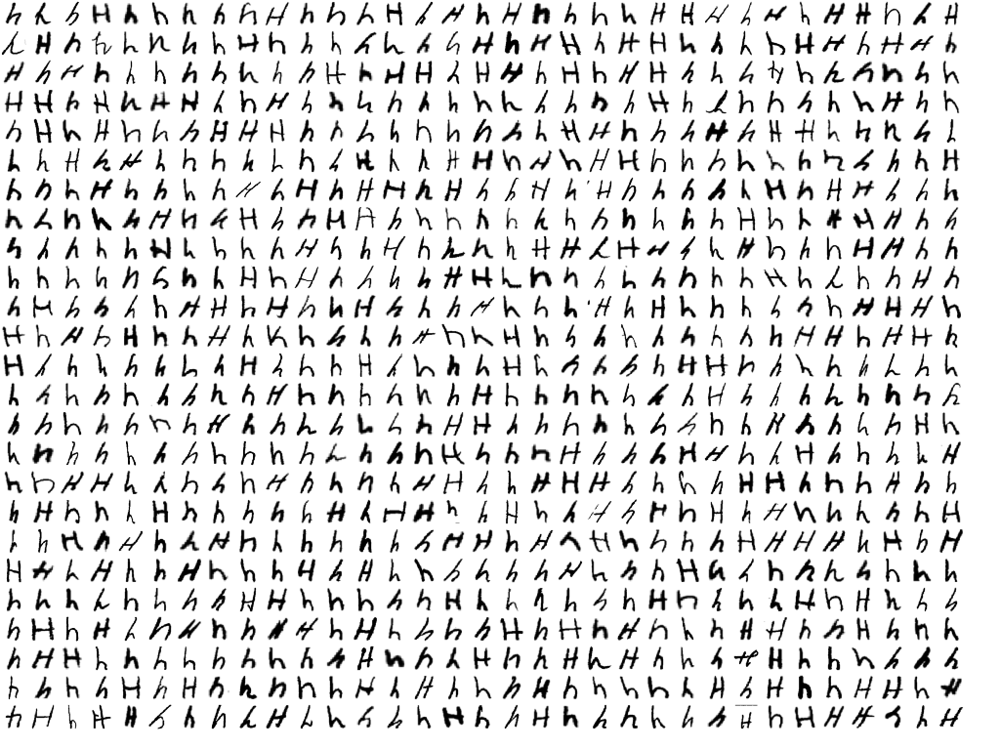

The previous chapters have often mentioned the chasm between "my deep learning neural network works on my data" and "it actually works in the real world". It is perhaps for this reason that almost all demos and youtube tutorials you find online never do any real world testing.

Here, we are going to do it, and this will allow us to experience first hand how hard this is. We're going to build a computer program that reads handwritten letters from a provided photo, based [on the convolutional model developed earlier](../dl-convolutional/#convolutional-networks).

Here is our input image, which already has a story behind it:

<center>


<p></p>
</center>

When I first got the OCR program working, results were very depressing. The network struggled mightily on some letters, often just not getting them right. Whatever I did, the 'h' would not work for example. First I blamed my own sloppy handwriting, but then I studied what the network was trained on:

<center>



<p></p>
</center>

Compare this to how I (& many other Europeans) write an h:
<center>


<p></p>
</center>

No amount of training on the MNIST set is going to teach a neural network to consistently recognize this as an h - this shape is simply not in the training set.

So that was the first lesson - really be aware of what is in your training data. If it is different from what you thought, results might very well disappoint. To make progress, I changed my handwriting in the test image to something that looks like what is actually in the MNIST data.

# Practicalities
The source code of the OCR program [is here](https://github.com/berthubert/hello-dl/blob/main/img-ocr.cc), and it is around 350 lines. For image processing, I found the [stb collection](https://github.com/nothings/stb) of single-file public domain include files very useful. 

So what we have is a network that does pretty well on 28 by 28 pixel representations of letters, where the background pixel value is 0. By contrast, input images tend to have millions of pixels, in full colour even, and where black pixels have a value of 0, so the inverse of our training.

The first thing to do is to turn the image into a gray scale version, where we also adjust the white balance so black is actually black and where the gray that passes for white is actually white.

From OCR theory I learned that the first step in character segmentation is to recognize lines of text. This is done by making a graph of the total intensity per horizontal line of the image. From this graph, you then try to select intervals of high intensity that look like they might represent a line of text.

For each line, you then travel from left to right to try to box in characters.

This leads us to:
<center>


<p></p>
</center>

Note that this is already hard work, and not very robust. How hard this is is yet another reminder that a lot of machine learning is in fact preprocessing your data so it cooperates. Compare it to painting a house - lots of sanding and tape, and finally a fun bit of painting.

The code that does this segmentation in [img-ocr.cc](https://github.com/berthubert/hello-dl/blob/main/img-ocr.cc) is none too pretty and has only been worked on so it does enough of a job that we can demo our actual neural network. (Pull requests welcome!)

# Loading the network
Firing up the network is much like we did while training:

```C++
ConvoAlphabetModel m;
ConvoAlphabetModel::State s;

cout<<"Loading model state from file '"<<argv[2]<<"'\n";

loadModelState(s, argv[2]);
m.init(s, true);
auto topo = m.loss.getTopo();
```

Of some note is that we initialize the network with the production parameter set to `true`. This means that the network will not perform *dropout* ([as described in the previous chapter](../dropout-data-augmentation-weight-decay/#dropout)). Dropout can be used during training to hide a lot of data from neural network so as to prevent overfitting.

# Processing the letter
Once we have a box around a letter, yet more work needs to happen. Our network needs a 28x28 pixel version, which is not what we get. Usually we get a lot more pixels, but not necessarily with a square aspect ratio. To make our box square, we enlarge the smallest dimension so it has the same size as the largest one. From [stb_image_resize.h](https://github.com/nothings/stb/blob/master/stb_image_resize.h) we get functionality to do high quality resizing. 

As another example of how things tend to be more difficult than you think, the MNIST training data is 28x28 pixels, BUT, the outer 2 pixels are always empty. So in fact, the network trains on 24x24 sized letters. This means that to match our image data to our network, we had best also resize letters to 24x24 pixels, and place them in the middle of a 28x28 grid.

> Note that if we performed [data augmentation](../dropout-data-augmentation-weight-decay/#data-augmentation), our network should be robust against off center letters, or pixels in the outer two rows. But let's not make life harder than necessary for our model.

This is the code that inputs the preprocessed image into the `m.img` member of the model we initialized above:

```C++
m.img.zero();
for(unsigned int r=0; r < 24; ++r)
  for(unsigned int c=0; c < 24; ++c)
    m.img(2+r,2+c) = scaledpic[c+r*24]/255.0;
    
m.img.normalize(0.172575, 0.25);
```

On the last line, we perform normalization [as described previously](../dropout-data-augmentation-weight-decay/#normalization) so that the pixels have a similar brightness to what the network is used to. This may feel like cheating, but this kind of normalization is an objective mathematical operation. Your eyes for example do the same thing by dilating your pupils so the photoreceptor cells receive a normalized amount of photons. Those cells in turn again also change their sensitivity depending on light levels. 

Next up, we can ask the network what it made of our character:

```C++
m.expected.oneHotColumn(0);
m.modelloss(0,0); // makes the calculation happen
    
int predicted = m.scores.maxValueIndexOfColumn(0);
cout<<"predicted: "<<(char)(predicted+'a')<<endl;
```

Again this is a lot like training the network, with one specific change. In this case, we honestly don't know what letter to expect. We are asking our network to figure that out for us. However, we can't leave the expectation value unset as this could cause out of range errors. We therefore configure `expected` that our expectation is 0, which corresponds to an 'a'.

# Bling
To make it pretty, the code then modifies the image to print its best guess of the letter below it:

<center>


<p></p>
</center>

Now, if you run the training yourself (which I encourage you to do), you'll find that the network will always make a few mistakes. In this sample, it gets the L wrong and thinks it is a C. It does the same for the T. If you train with different settings, it will get other letters wrong. 

In this animated version, recorded while a network was learning, you can see the network flip around as it is improving:

<center>
<video width="100%" autoplay loop muted>
    <source src="../hello-deep-learning/learning.mp4"
            type="video/mp4">
    Sorry, your browser doesn't support embedded videos.
</video>
</center>

It is highly instructive to try to improve [img-ocr.cc](https://github.com/berthubert/hello-dl/blob/main/img-ocr.cc) and pull requests are welcome! 

But, always check what the training data say - for example, the specific form of the 't' that the network got wrong above [is not present a lot in the training set](t-poster.png).

TBC
