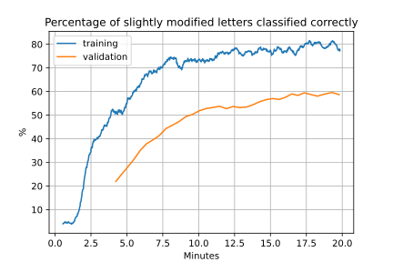
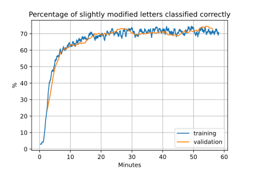
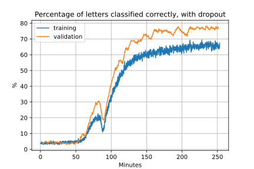
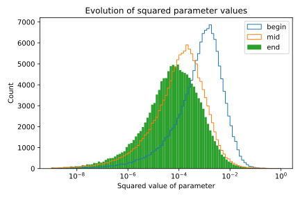
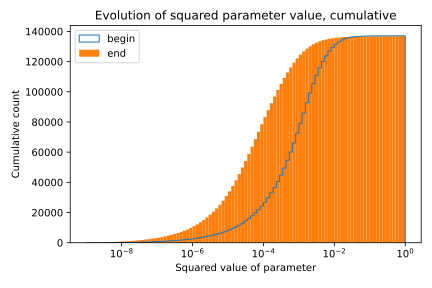
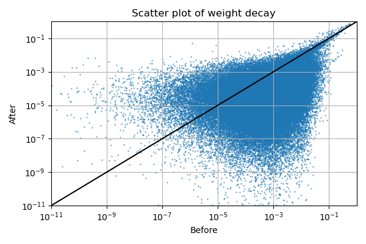

> This page is part of the [Hello Deep Learning](../hello-deep-learning) series of blog posts. You are very welcome to improve this page [via GitHub](https://github.com/berthubert/hello-dl-posts/blob/main/dropout-data-augmentation-weight-decay/index.md)!

In the previous chapter we found ways to speed up our character recognition learning by a factor of 20 by using a better optimizer, and a further factor of four by cleverly using threads using a 'shared nothing architecture'. We also learned how we can observe the development of parameters.

So our convolutional network is now super fast, and performs well on training and validation sets. But is is robust? Or has it internalized too much of the training set details?

Previously we found that the performance of our handwritten digit recognizer plummeted if we flipped a few pixels or moved the digit around slightly. And the reason behind that was that the linear combination behind that network was tied to actual pixel positions, and not to shapes.

We now have a fancy and fast convolutional network that can theoretically do a lot better. Let's see how the network performs with slightly modified inputs:

<center>



<p></p>
</center>

Well, that is disappointing. Although results are better than with the simple linear combination, we still take a significant hit when we move the image by only two pixels, and flip 5 random pixels from light to dark. No human being would be fooled (or perhaps even notice) these changes.

How is this possible? It turns out that a network can't learn from what it doesn't see. If all the inputs are centered exactly and have no noise, the network never learns to deal with off-center or corrupted inputs.

In this post we'll go over several modern techniques to enhance performance, robustness and efficiency.

# Data augmentation
Through a technique called [data augmentation](https://en.wikipedia.org/wiki/Data_augmentation), we can shake up our training set, making sure our network is exposed to more variation. And lo, when we do that, training and validation again score similarly, and only slightly worse than on unmodified data:

<center>



<p></p>
</center>

Data augmentation has several uses. It can make a network more robust by erasing hidden assumptions - even those you might not have been aware of. Hidden constant factors between training and validation sets are a major reason why networks that appear to do well, fail in the field. Because out there in the real world, samples aren't neatly centered and free from noise. 

In addition, if you have a lack of training data, you can augment it by creating modified versions of inputs. This in effect enlarges your training set. Possible modifications include skewing or rotating images, adding noise, or making inputs slightly larger or smaller, changing colors. It pays to try a lot of things - the more you try, the larger your chances are of creating a dataset that can only be learned by understanding the essence of the inputs.

In the demo code, data augmentation is implemented [here](https://github.com/berthubert/hello-dl/blob/main/tensor-convo-par.cc#L24). It moves the image around by -2 to +2 pixels, and flips the value of 5 random pixels.

# Normalization
The inverse of data augmentation might be called normalization. Many training sets were gathered using highly repeatable measurements. For examples, faces were photographed under the same lighting, or scanned images were normalised to a certain average brightness, with similar standard deviations. 

You could undo such normalisation by brightening or dimming your inputs, and retraining. Or you could do the reverse and also normalise any inputs before running your network. Most networks, including our letter reading one, perform such normalisation. This is appropriate for any metric where you can objectively normalise. This is for example not the case for unskewing or rotating images back to their 'normal' state, because you don't know what that looks like.

Our demos so far have been doing image normalization like this:

```C++
d_model.img.normalize(0.172575, 0.25);
```
This normalizes the mean pixel value to 0.172575 and the standard deviation to 0.25. So why these specific numbers? I applied a common machine learning trick: I picked them [from another model that works well](https://github.com/pytorch/examples/blob/main/cpp/mnist/mnist.cpp).

# Dropout
Another important technique to make networks generalise is called 'dropout'. By randomly zeroing out parts of the network, we force it to develop multiple pathways to determine how to classify an input. In addition, the network can't rely on accidental features to do classification since it won't always see those accidental features.

Once the network is in production, we no longer perform the dropout, which gives a relative boost to performance. In some contexts, dropout is absolutely mandatory, but it does not do a lot for our letter recognizer. It does make learning harder:

<center>


<p></p>
</center>

Note that here the validation clearly outperforms the training set, which is made harder by the dropout. Training also takes a lot longer, and in some cases does not converge. It does however lead to a network that should be immune against overtraining. Overtraining is easily recognized when performance on the training set is higher than on the validation set. Dropout reverses that.

If dropout is set to 50%, on average 50% of values of a tensor will be set to zero. Little known fact is that [the other values are then doubled](https://pytorch.org/docs/stable/generated/torch.nn.Dropout.html). This means that the overall impact of this tensor is retained (on average).

In our code, the implementation is an element-wise multiplication of a tensor with a tensor filled with zeros for blanked out positions, and the multiplication factor for the rest.

# Weight decay
Not all parts of a network end up being used. But they are still there, and the parameters in those unused parts can have large numerical values. These parts could however become active for certain inputs that weren't observed during training, and then disrupt things, degrading the network's performance. 

It could therefore be useful to put a slight zero-ward pressure on parameter values that apparently have no impact. This has a deep analogy to what happens in biology, where genes that are not used tend to decay to a non-functional state, and in the case of microbial life, even get cut out of the genome. 

In neural networks, a surprisingly easy way to achieve a similar effect is by including the sum of all squared parameters in the loss function. Recall that the learning process effectively tries to minimise the loss to zero - by adding these squared values, there is an automatic zero-ward pressure. This works surprisingly well, and I think this is pretty meaningful.

<center>


<p></p>
</center>

Here we take a previously trained model and then turn on weight decay. Note how the distribution shifts leftward. The move appears modest, but this is a logarithmic plot. Many parameters go down by a factor of 10 or more. Here is a cumulative distribution:

<center>


<p></p>
</center>

Here we can see that initially 20,000 parameters had a squared value of less than 0.0001. After the weight decay process, this number goes up to 80,000. 

If we look at each parameter:

<center>


<p></p>
</center>

Here everything below the black line represents a decrease of a parameter's squared value. It can be seen that especially larger values are reduced by a large fraction.

Essentially, after weight reduction we have a network that still functions well, but now effectively with a lot less parameters (if we remove tiny values). I find it pretty remarkable that we can achieve this just by adding the squared value of all values to the loss function. Such a simple mathematical operation yet it gives is a simpler network.

The implementation is near trivial:
```C++
if(weightfact(0,0) != 0.0) {
  weightsloss = weightfact*(s.c1.SquaredWeightsSum() +  s.c2.SquaredWeightsSum() +  s.c3.SquaredWeightsSum() +
                            s.fc1.SquaredWeightsSum() + s.fc2.SquaredWeightsSum() + s.fc3.SquaredWeightsSum());
      
  loss = modelloss + weightsloss;
}
else
  loss = modelloss;
```

Here `weightfact` is how heavy to weigh down on the squared weights. 0.02 appears to work well for our model.

On a closing note, the number of parameters impacts how much memory and CPU/GPU a model requires to function. Currently, networks use gigantic amounts of electrical powers, which is not sustainable. If we can use this technique to slim down networks, that would be very good.

In addition, we might be able to understand better what is going on if we have fewer parameters to look at.

# Quantisation
From the histograms above, we can see that most parameter values cluster close together. In most networks, such parameters are stored as 32 bit single precision floating point numbers. But do we actually need all those 32 bits? Given by how much we could drive down the parameter values with no impact on performance, it is clear we do not need to store very large numerical values.

We can easily imagine a reduction to 16 bits working - this effectively only adds some noise to the network. And indeed, the industry is rapidly moving to 16 bits floating point. Even [processors](https://networkbuilders.intel.com/solutionslibrary/intel-avx-512-fp16-instruction-set-for-intel-xeon-processor-based-products-technology-guide) and GPUs have gained native ability to perform operations on such half-precision floating point numbers.

It turns out however that on large language model networks, one can go down to **4 bit precision** without appreciable loss of performance. Hero worker [Georgi Gerganov](https://ggerganov.com/) has implemented such quantisation in his [C++ version of Facebook's Llama model](https://github.com/ggerganov/llama.cpp), and it works very well. 

To perform quantisation, values are divided into 2^n bins of equal population, like this:
<center>


<p></p>
</center>

And values are then stored as 4 bits, indicating which bin they correspond to. Interestingly enough, there are even binary networks with only two values. Out there in the real world, 8-bit networks [are already seeing production use](https://blog.plumerai.com/). 

> This is the only feature discussed in this blog series that is not (currently) present in the demo code. 

# Summarising
There is a lot that can be done to networks to improve their efficiency and performance. By augmenting our data, through small changes, we can make sure the network is exposed to more variation, and in this way become more robust against real life input.

Similarly, by performing internal dropout, the network is forced to learn how to recognize the input while not being able to rely on artifacts.

By adding a fraction of the squared value of parameters to the loss function, we can perform weight decay, which drives parameters to zero if they are not contributing to the result. This again aids in robustness, since stray unused neurons have less chance of interfering. Furthermore, we might drop very small value neurons from our network entirely, and still have a working network.

Finally, quantisation is the art of storing the weights in fewer bits which, kinda surprisingly, can be done without impacting performance too much.

Next up, [we are going to do some actual OCR with what we've learned](../dl-ocr-demo)!
