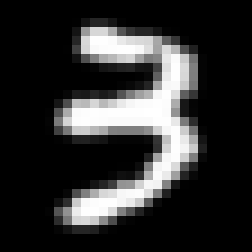
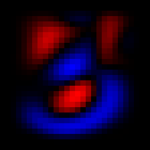
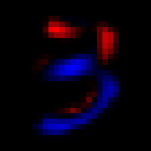
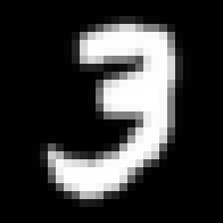
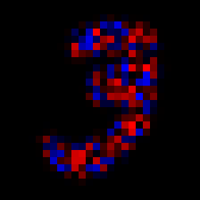
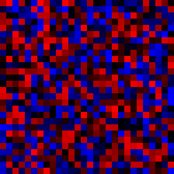
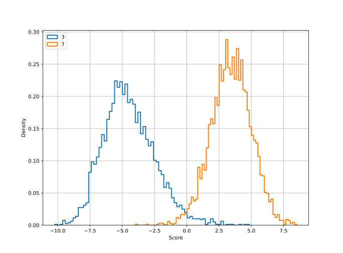

> This page is part of the [Hello Deep Learning](../hello-deep-learning) series of blog posts.

In this chapter we're going to take [the neural network we made earlier](../hello-deep-learning), but actually make it do some learning itself. And, oddly enough, this demonstration will again likely simultaneously make you wonder "is this all??" and also impress you by what even this trivial stuff can do.

The first part of this chapter covers the theory, and shows no code. The second part explains the code that makes it all happen. You can skip or skim the second part if you want to focus on the ideas.

## The basics
[Earlier we configured a linear combination neural layer](../hello-deep-learning), in which we used an element-wise multiplication to recognize if an image was a 3 or a seven:


<style>
table, th, td {
  border: 0px solid black;
}
</style>


<center>

<table><tr>
    <td width="32%"> </td>
    <td style="text-align: center;"><p style="font-size:30px; color: red">*</p></font></td>
    <td width="32%"></td>
<td style="text-align: center;"><p style="font-size:30px; color: red">=</p></font></td>
    <td width="32%"> </td>
    </tr>
</table>
<p></p>

</center>

This network achieved impressive accuracy on the very clean and polished EMNIST testing data, but partially this is because we carefully configured the network by hand. It did no learning of itself.

## How about some actual learning
Key to calculating the verdict if something is a 3 or a 7 is the *weights* matrix. We manually initialized that matrix in the previous chapter. In machine learning, it is customary to randomly initialize the parameters. [But to what](https://towardsdatascience.com/weight-initialization-in-neural-networks-a-journey-from-the-basics-to-kaiming-954fb9b47c79)? In practice, libraries tend to pick values uniformly distributed between 
-1/\sqrt{N}  and 1/\sqrt{N}, where N is the number of coefficients in the input matrix. 

Such a randomly chosen matrix will of course not yet be of any use:

<center>
<table><tr>
    <td width="32%"> </td>
        <td style="text-align: center;"><p style="font-size:30px; color: red">*</p></font></td>
    <td width="32%"></td>
            <td style="text-align: center;"><p style="font-size:30px; color: red">=</p></font></td>
    <td width="32%"> </td>
    </tr>
</table>
<p></p>

</center>

The result of this multiplication and subsequent summation is 0.529248, so our random weights got it wrong: this is actually a three, and the resulting score should have been negative.

So, what to do? What's the simplest thing we could even do?

Recall that the 'score' we are looking at is the sum of the element-wise product of the image pixels (p_n) and the weights (w_n). Or, concretely, this summation over 28*28=784 elements:

R=p_1w_1 + p_2w_2 + \cdots + p_{783}w_{783} + p_{784}w_{784}

Our current random weights delivered us an R that was too high. We can't change the input image pixels, but we can simply decide to lower the various weights, as this will deliver a lower R. So by how much should we lower them?

There is no impact for this image if we lower w_1 since the first pixel p_1 is 0 (black). And in fact, we'll get the biggest impact if we lower parameters in places of bright pixels. 

In practice in neural networks, we often lower each w_n by 0.1p_n. This is then called a 'learning rate of 0.1'. Note that this effectively means: make bigger changes where they matter more. 

We do this lowering (or raising) in the direction of the desired outcome. So if the network had looked at a seven and produced a negative output, we'd be doing this learning in the opposite direction by increasing the weight parameters by 0.1 of the value of the input pixel.

Now, although this sounds ridiculously simple minded ("just twist the knobs so the score goes in the right direction"), let's give this a spin:

```
$ ./37learn 
Have 240000 training images and 40000 validation images.
50.5375% correct
50% correct
81.8125% correct
86.675% correct
58.8% correct
85.65% correct
79.375% correct
...
98.025% correct
```

Recall how our carefully hand-configured neural network managed to achieve 97.025%. Here is an animation (left) showing the evolution of the weights matrix, from its initial random form to something remarkably like what we hand-configured earlier (right):

<center>

 

<p></p>

</center>

And here is the histogram of scores:

<center>



<p></p>

</center>

It appears that even our astoundingly simplistic learning technique delivered a pretty good result.

The process described above is called 'backpropagation', and it is at the absolute core of any neural network, including ChatGPT3 or any other mega impressive network you may have heard about. Continuing the theme from the previous chapter, it is confusing that a technique this simple and unimpressive might have such remarkable success. 

In the next chapter we'll talk more about this process, and the computational challenges that it brings across more complex networks.

# The code
Now for the real details. The code [can be found here](https://github.com/berthubert/hello-dl/blob/main/37learn.cc).

```C++
Tensor weights(28,28);
weights.randomize(1.0/sqrt(28*28));

saveTensor(weights, "random-weights.png", 252);

float bias=0;
```

We start out by initializing a weights matrix to random numbers between -1/\sqrt{28*28}  and 1/\sqrt{28*28}. In the informal explanation above, I neglected to mention the *bias*, which is part of the score formula:

 R =\sum{\mathit{image}\circ{}w} + b 

Next up we need to set the *learning rate*:
```C++
Tensor lr(28,28);
lr.identity(0.01);
```
The learning rate is what we need to multiply our image with to know how much to adjust the weights. Now, we'd love to just multiply the image by 0.01, but that is not how matrices work. If you want to multiply each coefficient of a matrix by a factor, you need to set up another matrix with that factor on all diagonal coefficients ('from the top left to the bottom right'). Our tensor class has an `identity()` method just for that purpose. [This Wikipedia page](https://en.wikipedia.org/wiki/Identity_matrix) may or may not be helpful.

> Earlier on this page we mentioned 0.1 as a typical learning rate. Here I've chosen 0.01 since the network learns plenty fast already, and by slowing it down, the final results improve a bit. This is because the network can seek out optima somewhat more diligently. In a later chapter we'll read about learning rate schedulers that automate this process.

Next up, let's do some learning:

```C++
for(unsigned int n = 0 ; n < mn.num(); ++n) {
  int label = mn.getLabel(n);
  if(label != 3 && label != 7)
    continue;

  if(!(count % 4)) {
    if(doTest(mntest, weights, bias) > 98.0)
      break;
  }
```

As earlier, this goes over all training samples of EMNIST. In addition, after every 4 images, we test our weights and bias against the validation database. If this `doTest` function returns that we got more than 98% of images correct, we leave the loop.

Next:

```C++
  Tensor img(28,28);
  mn.pushImage(n, img);
  float res = (img.dot(weights).sum()(0,0)) + bias; // the calculation
  int verdict = res > 0 ? 7 : 3;

  if(label == 7) {
    if(res < 2.0) {
      weights.raw() = weights.raw() + img.raw() * lr.raw();
      bias += 0.01;
    }
  } else {
    if(res > -2.0) {
      weights.raw() = weights.raw() - img.raw() * lr.raw();
      bias -= 0.01;
    }
  }
  ++count;
}
```
This is where the actual learning happens. If we just fed the neural network a 7, and if the calculated score was less than 2, we increase all the weights by `lr` of the associated pixel value.

Similarly, if we fed the network a 3, we lower all the weights, unless the score was already below -2.

The reason we test against 2 or -2 is that otherwise the network would eventually move parameters all the way to infinity. 

In upcoming chapters we'll see how the use of [activation functions](https://en.wikipedia.org/wiki/Activation_function) replaces the need for such crude limits.

As earlier, the somewhat ugly `.raw()` functions are necessary to prevent the slightly magic `Tensor` class from doing all kinds of work for us. In the next chapter, we're going to dive further into the theory of backpropagation, and that is when the `Tensor` class is going to shine.

Rounding off this chapter, using a surprisingly [small amount of code](https://github.com/berthubert/hello-dl/blob/main/37learn.cc) we've been able to make a neural network learn how to distinguish between images of the digits 3 and 7. It should be noted that this is very clean data, and that by focusing on only 2 digits the task isn't that hard. 

Still, as earlier, it is somewhat disconcerting how effective these techniques are even when what we are doing appears to be trivial.

In the next chapter, [we're going to learn all about automatic differentiation](../autograd).

