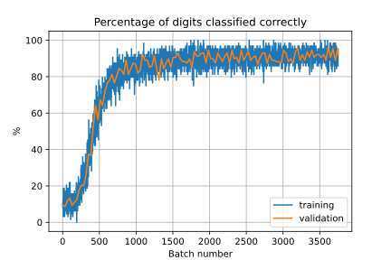
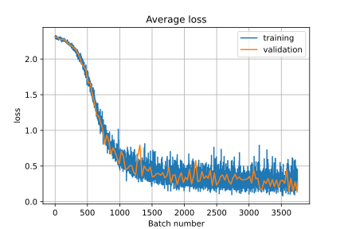

> This page is part of the [Hello Deep Learning](../hello-deep-learning) series of blog posts. You are very welcome to improve this page [via GitHub](https://github.com/berthubert/hello-dl-posts/blob/main/handwritten-digits-sgd-batches/index.md)!

In the [previous chapter](../autograd) we described how automatic differentiation of the result of neural networks works. 

In the first and second chapters we designed and trained a one-layer neural network that could distinguish images of the digit 3 and the digit 7, and the network did so very well. But honestly, it is not that difficult also.

The next challenge is to recognize and classify all ten digits. To do so, we'll use a network that does the following:

1. Flatten 28x28 image to a 784x1 matrix
2. Multiply this matrix by a 128x784 matrix ('lc1')
3. Replace all negative elements of the resulting matrix by 0
4. Multiply the resulting matrix by a 64x128 matrix ('lc2')
5. Replace all negative elements of the resulting matrix by 0
6. Multiply the resulting matrix by a 10x64 matrix ('lc3')
7. Pick the highest row of the resulting 10x1 matrix, this is the digit the network thinks it saw

Or, in code form:

```C++
auto output = s.lc1.forward(makeFlatten({img}));  // 1, 2
auto output2 = makeFunction<ReluFunc>(output);    // 3
auto output3 = s.lc2.forward(output2);            // 4
auto output4 = makeFunction<ReluFunc>(output3);   // 5
auto output5 = s.lc3.forward(output4);            // 6
scores = makeLogSoftMax(output5);                 // 7a

...
int predicted = scores.maxValueIndexOfColumn(0);  // 7b
```

So, what is going on here? First we turn the image into a looooong matrix of 784x1, using a call to `makeFlatten`. This loses some spatial context - neighboring pixels are no longer necessarily next to each other. But it is necessary for the rest of the operations.

The flattened matrix now goes through `lc1`, which is a linear combination layer. Or in other words, a matrix multiplication.

Next up, the `ReluFunc`. This 'rectified linear unit' is nothing other than an if statement: `if(x<0) return 0; else return x`. If we would stack multiple linear combinations, this would not add any extra smarts to the network - you could summarise two layers as one layer with different parameters. Inserting a non-linear element like 'ReLu' changes this.

> From the excellent [FastAI notebook on MNIST](https://github.com/fastai/fastbook/blob/master/04_mnist_basics.ipynb):
"Amazingly enough, it can be mathematically proven that this little function can solve any computable problem to an arbitrarily high level of accuracy, if you can find the right parameters for w1 and w2 and if you make these matrices big enough. For any arbitrarily wiggly function, we can approximate it as a bunch of lines joined together; to make it closer to the wiggly function, we just have to use shorter lines. This is known as the [universal approximation theorem](https://towardsdatascience.com/how-do-relu-neural-networks-approximate-any-continuous-function-f59ca3cf2c39)."
> Incidentally, I can highly recommend reading the FastAI notebook after you've finished with my 'from scratch' series. The FastAI work will then make sense, and will allow you to convert your from scratch knowledge into deep learning frameworks that people actually use.

After the first ReLu, we pass our data through a second linear combination, after which follows further ReLu, and a final linear combination. 

# LogSoftMax, "Cross Entropy Loss"
Ok - here we are going to make some big steps and introduce a lot of modern machine learning vocabulary.

In our previous example, the network had one output, and if it was negative, we would interpret that as a prediction of a three. 

Our present network has a more difficult task, determining which of 10 digits we are looking at. After step 6 of our network, we have a 10x1 matrix full of values. The convention is that the highest valued coefficient in that represents the network's verdict.

Recall that earlier we made the network 'learn in the right direction' by comparing the output to what we'd hope to get. We set a target of '2' or '-2' by hand, and remarked that this was an ugly trick we'd get rid of later on. That moment is now.

All machine learning projects define a 'loss value' calculated by the 'loss function'. The loss represents the distance between what a network predicts, and what we'd like it to predict. In our previous example, we informally used a loss function of min(2 - R, 0), and trained our network to minimize this loss function.

Or in other words, as long as R<2 we'd change the parameters to increase R.

This is the key concept of neural network learning: modify the parameters so that the loss function goes down. And to do so, take the derivative of the loss function against all parameters. Then subtract a fraction of that derivative from all the parameters.

This only works if we can get a *single number* to come out of our network. But recall, the digit recognizing network we are designing on this page has *10* outputs. So some work is in order.

In practice, we first feed all the outputs to a function called '*LogSoftMax*':


\text{LogSoftmax}(x_{i}) = \log\left(\frac{\exp(x_i) }{ \sum_j \exp(x_j)} \right) = x_i - \log\left(\sum_j \exp(x_j)\right)


If we put in 10 inputs, out come 10 outputs, but now lowered by the logarithm of the sum of the exponent of all elements.

This looks like:


```Python
#      0     1      2       3      4      5     6       7      8      9
In:  [-2.5, -4,    -3,    -0.5,  -4.4,    4,    -0.75, -0.25, -0.5,  -2.0]
Out: [-6.5, -8.04, -7.05, -4.55, -8.459, -0.05, -4.80, -4.30, -4.55, -6.05]
```

This would correspond to a network saying '5', which has the highest number. The output of `LogSoftMax` is typically interpreted as a log probability. Or in other words, the network is then regarded to say it predicts with e^{-0.05}=95\% probability that it is looking at a 5.

LogSoftMax works well for a variety of reasons, one of which is that it prevents the "pushing to infinity" we had to safeguard against in chapter 2. When using LogSoftMax as part of the loss function, we know that 0 is the best answer we're ever going to get ('100% certain'). But, because of the logarithms in there, the 'push' becomes ever smaller the closer we get to zero.

But, we still have 10 digits to look at, and we need just 1 for our loss value. To do this, it is customary to construct a "one hot vector", a matrix consisting of all zeroes, except at the index of the number we were expecting. 

So to get to the loss value, we do:

```
scores=[-6.5, -8.04, -7.05, -4.55, -8.459, -0.05, -4.80, -4.30, -4.55, -6.05]
onehotvector=[[0],[0],[0],[0],[0],[1.0],[0],[0],[0],[0]]
loss = -scores*onehotvector = 0.05
```
Where \* denotes a matrix multiplication. Here, the loss is 0.05, since the value at index 5 (the digit we know we put into the network) is -0.05. The negation is there because 0 is the very best we're ever going to get, but we are approaching it from negative territory. This technique goes by the pompous name of '[cross entropy loss](https://pytorch.org/docs/stable/generated/torch.nn.CrossEntropyLoss.html)'.

Once we have the loss number, we can take the derivative, and adjust the parameters of the matrices with a fraction of that derivative. 

# Recap
Because this is so crucial, let's go over it one more time.

Our neural network consists of several layers. We turn our image into a 1-dimensional matrix, multiply it by another matrix, replace all negative elements by zero, repeat the last two steps once more, and then a final matrix multiplication. Ten values come out. We do a logarithmic operation on these numbers, and turn them into 10 log-probabilities. 

The highest log-probability we can get is 0, which represents 100%. We multiply the ten numbers by yet another 'expectation' matrix, which is zero, except for the place corresponding to the actual number we put in. Out comes the probability the network assigned to what we know is the right digit. 

If this log probability is -0.05, we say that we that we have a 'loss' of 0.05. 

This loss number is the outcome of all these matrix multiplications and ReLu operations, the LogSoftMax layer and finally the multiplication with the expectation matrix.

And because of the magic of [automatic differentiation from the previous chapter](../autograd), we can determine exactly how our loss function would change if we modified the three parameter matrices we used for multiplication. 

We then update those matrices with a fraction of the derivative, and we call this fraction the 'learning rate'.

# One final complication: batches
We could perform the procedure outlined above once per training digit. But this might cause our network to oscillate wildly between "getting the ones right", "getting the twos right" etc. For this and other reasons, it is customary to do the learning per batch. Picking a batch size is an important choice - if the batch size is too small (1, for example), the network might swerve. If it is too large however, we lose training opportunities. 

There is also a more hardware related reason to do this. Much machine learning happens on GPUs which only perform well if you give them a lot of work they can do in parallel. If you only process a single input at a time, much of your GPU will be idle. 

When we gather our learning from a batch and average the results, we call this [Stochastic gradient descent](https://en.wikipedia.org/wiki/Stochastic_gradient_descent) or SGD.


# Getting down to work
The code is in [tensor-relu.cc](https://github.com/berthubert/hello-dl/blob/main/tensor-relu.cc), where you'll find slightly more lines of code than described below. The additional lines perform logging to generate the graphs that demonstrate the performance of this model.

Here is the definition of our model:

```C++
struct ReluDigitModel 
{
  Tensor<float> img{28,28};
  Tensor<float> scores{10, 1};
  Tensor<float> expected{1,10};
  Tensor<float> loss{1,1};
  struct State : public ModelState<float>
  { //             IN    OUT
    Linear<float, 28*28, 128> lc1;
    Linear<float, 128,    64> lc2;
    Linear<float, 64,     10> lc3;

    State()
    {
      this->d_members = {{&lc1, "lc1"}, {&lc2, "lc2"}, {&lc3, "lc3"}};
    }
  };
  
```

Here we see how the state of a model is kept separate. This state is what contains the actual parameters. Note that the state derives from `ModelState<float>`. This parent class gives us common operations like `load()`, `save()`, `randomise()`, but also logging of everything to SQLite. To make sure that the parent class knows what to do, the `State` struct registers its members in its constructor.

Next up, let's hook it all up:

```C++
  void init(State& s)
  {
    auto output = s.lc1.forward(makeFlatten({img}));
    auto output2 = makeFunction<ReluFunc>(output);
    auto output3 = s.lc2.forward(output2);
    auto output4 = makeFunction<ReluFunc>(output3);
    auto output5 = s.lc3.forward(output4);
    scores = makeLogSoftMax(output5);
    loss = -(expected*scores);
  }
};
```

This mirrors the code we've seen earlier. In the last line of code we define the 'loss' function. And recall, this is all lazy evaluation - we're setting up the logic, but nothing is being calculated yet.

Next up, mechanics:

```C++
MNISTReader mn("gzip/emnist-digits-train-images-idx3-ubyte.gz", "gzip/emnist-digits-train-labels-idx1-ubyte.gz");
MNISTReader mntest("gzip/emnist-digits-test-images-idx3-ubyte.gz", "gzip/emnist-digits-test-labels-idx1-ubyte.gz");

ReluDigitModel m;
ReluDigitModel::State s;

if(argc==2) {
  cout << "Loading model state from '" << argv[1] << "'\n";
  loadModelState(s, argv[1]);
}
else
  s.randomize();

m.init(s);

auto topo = m.loss.getTopo();
Batcher batcher(mn.num());
```

The 'topo' line gets the topographical sort we'll be using later on, as described in the previous chapter.

The final line is a helper class called `Batcher`, which we pass the number of training images we have. This class then shuffles all these numbers. Later, we can request batches of N numbers for processing, and we'll get a random batch of numbers for processing.

Let's do just that:

```C++
for(unsigned int tries = 0 ;; ++tries) {
  if(!(tries % 32)) {
    testModel(m, mntest);
    saveModelState(s, "tensor-relu.state");
  }
    
  auto batch = batcher.getBatch(64);
  if(batch.empty())
    break;
  float totalLoss = 0;
  unsigned int corrects=0, wrongs=0;
```
Up to here it is just mechanics. Every 32 batches we test the model against our validation data, and we also save our state to disk. Next up more interesting things happen:

```C++
m.loss.zeroAccumGrads(topo);
    
for(const auto& idx : batch) {
  mn.pushImage(idx, m.img);
  int label = mn.getLabel(idx);
  m.expected.oneHotColumn(label);

  totalLoss += m.loss(0,0); // turns it into a float
      
  int predicted = m.scores.maxValueIndexOfColumn(0);

  if(predicted == label)
     corrects++;
  else wrongs++;

```
As noted, we process a whole batch of images before starting the learning process. Per image we look at we gather gradients through automatic differentiation. We need to add up all these gradients for the eventual learning. To make life easy, our `Tensor` class has a facility where you can stash your gradients. But, before we start a batch, we must zero the accumulated numbers. That's line 1.

Next up, we iterate over all numbers in the batch. For each number, we fetch the EMNIST image and the label assigned to it.
We then configure the `expected` variable, with the 'one hot' configuration which is 1 only for the correct outcome.

The `totalLoss += m.loss(0,0);` line looks like a bit of statistics keeping, but it is what actually triggers the whole network into action. We wake up the lazy evaluation. 

In the next line we look up the row in the scores matrix with the highest value, which is the prediction from the model.

Then we count the correct and wrong predictions.

Now we come to an interesting part again:
```C++
  // backward the thing
  m.loss.backward(topo);
  m.loss.accumGrads(topo); 
  // clear grads & havevalue
  m.loss.zerograd(topo);
}
```

This is where we perform the automatic differentiation (`.backward(topo)`). We then call `accumGrads(topo)` to accumulate the gradients for this specific image. Finally, there is a call to `.zeroGrad(topo)`. From the previous chapter, you'll recall how the gradients rain downward additively. If we run the same model a second time, we first need to zero those gradients so we start from a clean slate. 

Once we are done with a whole batch, we can output some statistics and do the actual learning:


```C++
cout << tries << ": Average loss " << totalLoss/batch.size()<< ", percent batch correct " << 100.0*corrects/(corrects+wrongs) << "%\n";
    
double lr=0.01 / batch.size();
s.learn(lr);
}
```

Of note, we divide the learning rate by the batch size. This is because we've accumulated gradients for each of the images in the batch, and we want to learn from their average and not their sum.

Finally, let's zoom in on what `s.learn(lr)` actually does:

```C++
void learn(float lr) 
{
  for(auto& p : d_params) {
    auto grad1 = p.ptr->getAccumGrad();
    grad1 *= lr;
    *p.ptr -= grad1;
  }
}
```

For each parameter, the accumulated gradients are gathered, and then multiplied by the learning rate. Finally, this reduced gradient is then subtracted from the actual parameter value.

# Giving it a spin!
Finally, let's run all this:

```bash
$ ./tensor-relu
Have 240000 training images and 40000 test images
                            
                            
             ...            
           *XXXXX.          
         .XXXXXXXX.         
        *XXXX*.*XX*..       
       *XXX*    XXXXXX      
      .XXX.     XXXXXX      
      *XX*      .XXXX*      
      *XX.      *XXX*.      
      *XXX   ..XXXXX.       
      .XXXXXXXXXXXXX        
       *XXXXXXXXXXX*        
        .****  .XXX.        
               *XX*         
               XXX.         
              .XX*          
             *XXX.          
             XXXX           
             XXX*           
            .XXX.           
            *XX*            
            XXX*            
           .XX*             
            X*.             
                            
                            
                            

predicted: 3, actual: 9, loss: 2.31289
Validation batch average loss: 2.30657, percentage correct: 9.375%
0: Average loss 2.31008, percent batch correct 9.375%
...
                            
            .X*             
           *XX*             
          .XX*              
         *XX*               
         XXX                
        *XX.                
       *XXX                 
       XXX                  
      *XX.                  
      XXX                   
     *XX.                   
    .XX*                    
    *XX          ...        
    XXX        *XXXXX       
    XX.     .XXXXXXXXX.     
    XX*   *XXXX*.   *XX.    
    XXX  XXXX*.      XX*    
    *XX.XXX*         .XX    
    .XXXXX*          .XX    
     *XXX.           *XX    
      XXX*          *XX*    
      XXXXX*......*XX*      
        *XXXXXXXXXX*        
          .*XXXXXX*         
                            
                            

predicted: 6, actual: 6, loss: 1.28472
Validation batch average loss: 1.39618, percentage correct: 76.5625%
...
Validation batch average loss: 0.276509, percentage correct: 92.225%
```
92.23%, not too shabby! Here are some customary ways of looking at performance, starting with a training/validation percentage correct graph:

<center>



<p></p>
</center>

The average loss per batch:

<center>



<p></p>
</center>

And finally the wonderfully named confusion matrix, which shows how often a prediction (vertical) matched up with the actual label (horizontal): 

<style type="text/css">
#T_599e6_row0_col0, #T_599e6_row1_col1, #T_599e6_row2_col2, #T_599e6_row3_col3, #T_599e6_row4_col4, #T_599e6_row5_col5, #T_599e6_row6_col6, #T_599e6_row7_col7, #T_599e6_row8_col8, #T_599e6_row9_col9 {
  font-size: 8pt;
  background-color: #000000;
  color: #f1f1f1;
}
#T_599e6_row0_col1, #T_599e6_row0_col2, #T_599e6_row0_col3, #T_599e6_row0_col4, #T_599e6_row0_col6, #T_599e6_row0_col7, #T_599e6_row0_col8, #T_599e6_row0_col9, #T_599e6_row1_col0, #T_599e6_row1_col2, #T_599e6_row1_col3, #T_599e6_row1_col4, #T_599e6_row1_col5, #T_599e6_row1_col6, #T_599e6_row1_col7, #T_599e6_row1_col9, #T_599e6_row2_col1, #T_599e6_row2_col4, #T_599e6_row2_col6, #T_599e6_row2_col7, #T_599e6_row2_col9, #T_599e6_row3_col0, #T_599e6_row3_col1, #T_599e6_row3_col4, #T_599e6_row3_col6, #T_599e6_row3_col7, #T_599e6_row4_col3, #T_599e6_row4_col7, #T_599e6_row5_col1, #T_599e6_row5_col2, #T_599e6_row5_col4, #T_599e6_row5_col6, #T_599e6_row5_col7, #T_599e6_row5_col9, #T_599e6_row6_col1, #T_599e6_row6_col3, #T_599e6_row6_col7, #T_599e6_row6_col8, #T_599e6_row6_col9, #T_599e6_row7_col0, #T_599e6_row7_col1, #T_599e6_row7_col2, #T_599e6_row7_col4, #T_599e6_row7_col5, #T_599e6_row7_col6, #T_599e6_row7_col8, #T_599e6_row8_col4, #T_599e6_row8_col6, #T_599e6_row8_col7, #T_599e6_row9_col0, #T_599e6_row9_col1, #T_599e6_row9_col2, #T_599e6_row9_col5, #T_599e6_row9_col6 {
  font-size: 8pt;
  background-color: #ffffff;
  color: #000000;
}
#T_599e6_row0_col5, #T_599e6_row2_col0, #T_599e6_row2_col5, #T_599e6_row2_col8, #T_599e6_row3_col2, #T_599e6_row3_col8, #T_599e6_row3_col9, #T_599e6_row4_col1, #T_599e6_row4_col6, #T_599e6_row4_col8, #T_599e6_row5_col0, #T_599e6_row6_col0, #T_599e6_row6_col4, #T_599e6_row6_col5, #T_599e6_row7_col3, #T_599e6_row8_col0, #T_599e6_row8_col2, #T_599e6_row8_col9, #T_599e6_row9_col3, #T_599e6_row9_col8 {
  font-size: 8pt;
  background-color: #fefefe;
  color: #000000;
}
#T_599e6_row1_col8, #T_599e6_row2_col3, #T_599e6_row4_col0, #T_599e6_row4_col2, #T_599e6_row4_col5, #T_599e6_row6_col2, #T_599e6_row8_col1, #T_599e6_row8_col3, #T_599e6_row8_col5 {
  font-size: 8pt;
  background-color: #fdfdfd;
  color: #000000;
}
#T_599e6_row3_col5, #T_599e6_row9_col4 {
  font-size: 8pt;
  background-color: #fcfcfc;
  color: #000000;
}
#T_599e6_row4_col9, #T_599e6_row5_col8 {
  font-size: 8pt;
  background-color: #fbfbfb;
  color: #000000;
}
#T_599e6_row5_col3 {
  font-size: 8pt;
  background-color: #fafafa;
  color: #000000;
}
#T_599e6_row7_col9, #T_599e6_row9_col7 {
  font-size: 8pt;
  background-color: #f9f9f9;
  color: #000000;
}
</style>
<table id="T_599e6">
  <thead>
    <tr>
      <th class="blank level0" >&nbsp;</th>
      <th id="T_599e6_level0_col0" class="col_heading level0 col0" >0</th>
      <th id="T_599e6_level0_col1" class="col_heading level0 col1" >1</th>
      <th id="T_599e6_level0_col2" class="col_heading level0 col2" >2</th>
      <th id="T_599e6_level0_col3" class="col_heading level0 col3" >3</th>
      <th id="T_599e6_level0_col4" class="col_heading level0 col4" >4</th>
      <th id="T_599e6_level0_col5" class="col_heading level0 col5" >5</th>
      <th id="T_599e6_level0_col6" class="col_heading level0 col6" >6</th>
      <th id="T_599e6_level0_col7" class="col_heading level0 col7" >7</th>
      <th id="T_599e6_level0_col8" class="col_heading level0 col8" >8</th>
      <th id="T_599e6_level0_col9" class="col_heading level0 col9" >9</th>
    </tr>
  </thead>
  <tbody>
    <tr>
      <th id="T_599e6_level0_row0" class="row_heading level0 row0" >0</th>
      <td id="T_599e6_row0_col0" class="data row0 col0" >3750</td>
      <td id="T_599e6_row0_col1" class="data row0 col1" >3</td>
      <td id="T_599e6_row0_col2" class="data row0 col2" >27</td>
      <td id="T_599e6_row0_col3" class="data row0 col3" >25</td>
      <td id="T_599e6_row0_col4" class="data row0 col4" >12</td>
      <td id="T_599e6_row0_col5" class="data row0 col5" >42</td>
      <td id="T_599e6_row0_col6" class="data row0 col6" >16</td>
      <td id="T_599e6_row0_col7" class="data row0 col7" >5</td>
      <td id="T_599e6_row0_col8" class="data row0 col8" >10</td>
      <td id="T_599e6_row0_col9" class="data row0 col9" >10</td>
    </tr>
    <tr>
      <th id="T_599e6_level0_row1" class="row_heading level0 row1" >1</th>
      <td id="T_599e6_row1_col0" class="data row1 col0" >4</td>
      <td id="T_599e6_row1_col1" class="data row1 col1" >3793</td>
      <td id="T_599e6_row1_col2" class="data row1 col2" >25</td>
      <td id="T_599e6_row1_col3" class="data row1 col3" >5</td>
      <td id="T_599e6_row1_col4" class="data row1 col4" >13</td>
      <td id="T_599e6_row1_col5" class="data row1 col5" >24</td>
      <td id="T_599e6_row1_col6" class="data row1 col6" >18</td>
      <td id="T_599e6_row1_col7" class="data row1 col7" >16</td>
      <td id="T_599e6_row1_col8" class="data row1 col8" >87</td>
      <td id="T_599e6_row1_col9" class="data row1 col9" >12</td>
    </tr>
    <tr>
      <th id="T_599e6_level0_row2" class="row_heading level0 row2" >2</th>
      <td id="T_599e6_row2_col0" class="data row2 col0" >32</td>
      <td id="T_599e6_row2_col1" class="data row2 col1" >9</td>
      <td id="T_599e6_row2_col2" class="data row2 col2" >3665</td>
      <td id="T_599e6_row2_col3" class="data row2 col3" >74</td>
      <td id="T_599e6_row2_col4" class="data row2 col4" >22</td>
      <td id="T_599e6_row2_col5" class="data row2 col5" >40</td>
      <td id="T_599e6_row2_col6" class="data row2 col6" >24</td>
      <td id="T_599e6_row2_col7" class="data row2 col7" >12</td>
      <td id="T_599e6_row2_col8" class="data row2 col8" >44</td>
      <td id="T_599e6_row2_col9" class="data row2 col9" >3</td>
    </tr>
    <tr>
      <th id="T_599e6_level0_row3" class="row_heading level0 row3" >3</th>
      <td id="T_599e6_row3_col0" class="data row3 col0" >7</td>
      <td id="T_599e6_row3_col1" class="data row3 col1" >31</td>
      <td id="T_599e6_row3_col2" class="data row3 col2" >32</td>
      <td id="T_599e6_row3_col3" class="data row3 col3" >3581</td>
      <td id="T_599e6_row3_col4" class="data row3 col4" >0</td>
      <td id="T_599e6_row3_col5" class="data row3 col5" >110</td>
      <td id="T_599e6_row3_col6" class="data row3 col6" >0</td>
      <td id="T_599e6_row3_col7" class="data row3 col7" >10</td>
      <td id="T_599e6_row3_col8" class="data row3 col8" >53</td>
      <td id="T_599e6_row3_col9" class="data row3 col9" >34</td>
    </tr>
    <tr>
      <th id="T_599e6_level0_row4" class="row_heading level0 row4" >4</th>
      <td id="T_599e6_row4_col0" class="data row4 col0" >70</td>
      <td id="T_599e6_row4_col1" class="data row4 col1" >34</td>
      <td id="T_599e6_row4_col2" class="data row4 col2" >68</td>
      <td id="T_599e6_row4_col3" class="data row4 col3" >3</td>
      <td id="T_599e6_row4_col4" class="data row4 col4" >3766</td>
      <td id="T_599e6_row4_col5" class="data row4 col5" >86</td>
      <td id="T_599e6_row4_col6" class="data row4 col6" >32</td>
      <td id="T_599e6_row4_col7" class="data row4 col7" >17</td>
      <td id="T_599e6_row4_col8" class="data row4 col8" >63</td>
      <td id="T_599e6_row4_col9" class="data row4 col9" >123</td>
    </tr>
    <tr>
      <th id="T_599e6_level0_row5" class="row_heading level0 row5" >5</th>
      <td id="T_599e6_row5_col0" class="data row5 col0" >48</td>
      <td id="T_599e6_row5_col1" class="data row5 col1" >32</td>
      <td id="T_599e6_row5_col2" class="data row5 col2" >22</td>
      <td id="T_599e6_row5_col3" class="data row5 col3" >143</td>
      <td id="T_599e6_row5_col4" class="data row5 col4" >3</td>
      <td id="T_599e6_row5_col5" class="data row5 col5" >3548</td>
      <td id="T_599e6_row5_col6" class="data row5 col6" >23</td>
      <td id="T_599e6_row5_col7" class="data row5 col7" >3</td>
      <td id="T_599e6_row5_col8" class="data row5 col8" >120</td>
      <td id="T_599e6_row5_col9" class="data row5 col9" >15</td>
    </tr>
    <tr>
      <th id="T_599e6_level0_row6" class="row_heading level0 row6" >6</th>
      <td id="T_599e6_row6_col0" class="data row6 col0" >38</td>
      <td id="T_599e6_row6_col1" class="data row6 col1" >18</td>
      <td id="T_599e6_row6_col2" class="data row6 col2" >79</td>
      <td id="T_599e6_row6_col3" class="data row6 col3" >7</td>
      <td id="T_599e6_row6_col4" class="data row6 col4" >52</td>
      <td id="T_599e6_row6_col5" class="data row6 col5" >48</td>
      <td id="T_599e6_row6_col6" class="data row6 col6" >3865</td>
      <td id="T_599e6_row6_col7" class="data row6 col7" >0</td>
      <td id="T_599e6_row6_col8" class="data row6 col8" >8</td>
      <td id="T_599e6_row6_col9" class="data row6 col9" >0</td>
    </tr>
    <tr>
      <th id="T_599e6_level0_row7" class="row_heading level0 row7" >7</th>
      <td id="T_599e6_row7_col0" class="data row7 col0" >3</td>
      <td id="T_599e6_row7_col1" class="data row7 col1" >3</td>
      <td id="T_599e6_row7_col2" class="data row7 col2" >26</td>
      <td id="T_599e6_row7_col3" class="data row7 col3" >40</td>
      <td id="T_599e6_row7_col4" class="data row7 col4" >2</td>
      <td id="T_599e6_row7_col5" class="data row7 col5" >12</td>
      <td id="T_599e6_row7_col6" class="data row7 col6" >0</td>
      <td id="T_599e6_row7_col7" class="data row7 col7" >3716</td>
      <td id="T_599e6_row7_col8" class="data row7 col8" >11</td>
      <td id="T_599e6_row7_col9" class="data row7 col9" >171</td>
    </tr>
    <tr>
      <th id="T_599e6_level0_row8" class="row_heading level0 row8" >8</th>
      <td id="T_599e6_row8_col0" class="data row8 col0" >46</td>
      <td id="T_599e6_row8_col1" class="data row8 col1" >73</td>
      <td id="T_599e6_row8_col2" class="data row8 col2" >55</td>
      <td id="T_599e6_row8_col3" class="data row8 col3" >83</td>
      <td id="T_599e6_row8_col4" class="data row8 col4" >21</td>
      <td id="T_599e6_row8_col5" class="data row8 col5" >75</td>
      <td id="T_599e6_row8_col6" class="data row8 col6" >22</td>
      <td id="T_599e6_row8_col7" class="data row8 col7" >22</td>
      <td id="T_599e6_row8_col8" class="data row8 col8" >3556</td>
      <td id="T_599e6_row8_col9" class="data row8 col9" >37</td>
    </tr>
    <tr>
      <th id="T_599e6_level0_row9" class="row_heading level0 row9" >9</th>
      <td id="T_599e6_row9_col0" class="data row9 col0" >2</td>
      <td id="T_599e6_row9_col1" class="data row9 col1" >4</td>
      <td id="T_599e6_row9_col2" class="data row9 col2" >1</td>
      <td id="T_599e6_row9_col3" class="data row9 col3" >39</td>
      <td id="T_599e6_row9_col4" class="data row9 col4" >109</td>
      <td id="T_599e6_row9_col5" class="data row9 col5" >15</td>
      <td id="T_599e6_row9_col6" class="data row9 col6" >0</td>
      <td id="T_599e6_row9_col7" class="data row9 col7" >199</td>
      <td id="T_599e6_row9_col8" class="data row9 col8" >48</td>
      <td id="T_599e6_row9_col9" class="data row9 col9" >3595</td>
    </tr>
  </tbody>
</table>


From this you can see for example that the network has some trouble distinguishing 7 and 9, but that it absolutely never confuses a 7 for a 6, or a 6 for a 9.

# Discussion
In the above, we've seen how we can configure a multi-layer network consisting of linear combinations, 'relu units', SoftLogMax and finally the expectation 'one hot vector'. We also made this network learn, and qualified its success.

This is about as far as linear combinations can go. And although 90+% correctness is nice, this network has really only learned what perfectly centered and rather clean digits look like. Concretely, this network is really attached to *where* the pixels are. We expect a network that somehow 'understands' what this is doing to not be so sensitive to placement.

However, we can still feel pretty good - this tiny network did really well on its simple job, and we know *exactly* how it was trained and what it does.

[In the next chapter](../dl-convolutional/), we'll be adding elements that actually capture shapes and their relations, which leads to greater generic performance, but also more complexity and training time. [We'll also be going over some common neural network disappointments](../dl-convolutional/).


