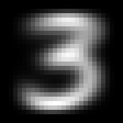
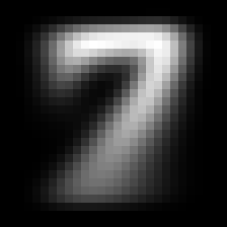
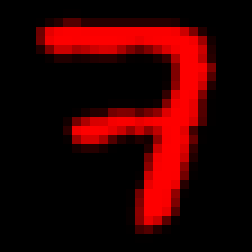

> This page is part of the [Hello Deep Learning](../hello-deep-learning) series of blog posts. You are very welcome to improve this page [via GitHub](https://github.com/berthubert/hello-dl-posts/blob/main/hello-deep-learning-chapter1/index.md)!

In this chapter we're going to build our first neural network and take it for a spin. Weirdly, this demonstration will likely simultaneously make you wonder "is this all??" and also impress you by what even this trivial stuff can do.

The first part of this chapter covers the theory, and shows no code. The second part explains the code that makes it all happen. You can skip or skim the second part if you want to focus on the ideas.


<style>
table, th, td {
  border: 0px solid black;
}
</style>



## Hello, world
The "Hello, world" of neural networks is the MNIST set of handwritten digits. Meticulously collected, sanitized and labeled, this collection of 280,000 images is perfect to get started with. Most tutorials use MNIST, but because this one is written in 2023, we can use the ['extended' and improved EMNIST dataset](https://www.nist.gov/itl/products-and-services/emnist-dataset).

For our first sample, we're going to write a neural network that can distinguish images of the digits 3 and 7, inspired by [this excellent FastAI tutorial for PyTorch](https://github.com/fastai/fastbook/blob/master/04_mnist_basics.ipynb).

To start out with, we're not yet going to have a network that can learn things. We're going to configure it explicitly, which is a great way of figuring out what is going on.

Neural networks are a lot about matrices and multiplying them. Confusingly, everyone in this world calls these matrices 'tensors', which is actually the wrong name for them. But I digress.

So, the first thing we do is represent the images of digits found in the EMNIST database as matrices, which allows us to do math on them. In this way we can calculate the following three matrices (shown as images):

<center>



  
*The average 3, the average 7, the difference between these two* 
<p></p>
</center>

We can average all 3's and all 7's and get these fuzzy representations. The last picture is the most interesting one: it represents the "average 7 minus the average 3". The red pixels are high values, areas where there typically is more 'seven' than 'three'. The blue parts are low values, where there is typically more 'three' than 'seven'. Black pixels meanwhile are neutral, and confer no 'threeness' or 'sevenness'. 

One elementary neural network layer is the linear combination whereby we multiply the input (here, the image of a digit) by a matrix of 'weights'. These weights are the parameters that are usually evolved by training a network, but we're not going to do that yet.

Instead, we're going to use the difference matrix shown above as the weights. Here what that looks like for a typical 3:

<center>

<table><tr>
    <td width="32%"> </td>
    <td style="text-align: center;"><p style="font-size:30px; color: red">*</p></font></td>
    <td width="32%"></td>
    <td style="text-align: center;"><p style="font-size:30px; color: red">=</p></td>
    <td width="32%"> </td>
    </tr>
</table>
<p></p>

</center>

This represents a coefficient-wise product of two matrices (also known as a [Hadamard-Schur product](https://en.wikipedia.org/wiki/Hadamard_product_(matrices))). Each pixel in the right-most image is the product of the pixel in the same place in the left and middle images. Because this is a typical 3, we see a lot of blue in the right. If we'd add up all the values of the pixels on the right, we'd end up with a negative number. This could then also be our decision rule: if the sum is negative, infer that this was an image of a 3.

Conversely, this is what it looks like for a 7:
<center>

<table><tr>
    <td width="32%">
     </td>
        <td style="text-align: center;"><p style="font-size:30px; color: red">*</p></font></td><td width="32%"></td>
            <td style="text-align: center;"><p style="font-size:30px; color: red">=</p></font></td><td width="32%"> </td></tr>
</table>
<p></p>

</center>

Here we see a lot of red on the right, indicating a lot of higher values. The sum of all pixels is likely going to be a positive number, which means we can correctly infer this was a 7.

Now, this is all ridiculously naive, but we can give it a try using the [threeorseven.cc](https://github.com/berthubert/hello-dl/blob/main/threeorseven.cc) program:
```
$ ./threeorseven 
Have 240000 training images and 40000 validation
Three average result: -10.7929, seven average result: 0.785063
82.2125% correct
```
That is quite something. So, this introduces another key aspect of machine learning: training and validation. The EMNIST set offers us 240,000 training images. To make sure that networks don't only memorise their training set, it is customary to validate models on a separate set of inputs. These are the 40,000 validation images. And true to form, the threeorseven.cc program calculates the averages only based on the training images, and then measures performance using the validation images.

Now, 82.21% is nice, but something else stands out in the output of the program. We originally thought that a negative score (sum of pixels in the rightmost image) would represent a 3. We do see that the average three scores negatively (-10.79), but the average seven is only barely positive (0.785). Let's make a histogram of scores:

<center>


<p></p>

</center>

Clearly 0 is not the right number to compare our score against. Our histograms have a definitive negative *bias*. Instead, we could use the middle between the average 3 score and the average 7 score:

```
$ ./threeorseven 
Have 240000 training images and 40000 validation
Three average result: -10.7929, seven average result: 0.785063
Middle: -5.00393
97.025% correct
```

That is pretty astounding. Using -5.00 as a decision rule we get 97.025% accuracy. This is approaching human level performance. Later we'll find out many reasons why we should not quite start celebrating yet though. But for now, this is quite impressive.

In the above we have set the 'weights' to the difference between average threes and sevens. We've also found a bias that we need to apply. In formula form:

 R =\sum{\mathit{image}\circ{}w} + b 

Here \circ stands for the coefficient-wise product, and \sum means we add up all coefficients.

If the result R is positive, we infer that \mathit{image} represents a 7.

Note that for reasons which will become apparent later, neural network linear combinations mostly do not use these 'square' matrices and Hadamard products, but instead flattened versions. The central equation then becomes a regular matrix multiplication:

 R =\mathit{image}\cdot{}w + b 

## Takeaway
From the above, we can see that given very clean data, simple multiplication and additions are sufficient for a properly configured neural network to do pretty well on a simple task. The demo above is a completely standard neural network layer, with the only simplification that we configured it by hand instead of letting it learn. I'm simultaneously impressed by what this simple layer can do, but you might at this stage also be wondering "is that it??". 

In the next chapter we'll cover how training works. And you'll likely again be wondering how something so simple can be so effective.

## The code
To start, clone the GitHub repository and download and unzip the EMNIST dataset:
```bash
git clone https://github.com/berthubert/hello-dl.git
cd hello-dl
cmake .
make -j4
wget http://www.itl.nist.gov/iaui/vip/cs_links/EMNIST/gzip.zip
unzip gzip.zip
```

We're going to look at [threeorseven.cc](https://github.com/berthubert/hello-dl/blob/main/threeorseven.cc).

The first thing the code does is to read the EMNIST data (which is formatted in the MNIST standard):

```C++
  MNISTReader mn("gzip/emnist-digits-train-images-idx3-ubyte.gz", "gzip/emnist-digits-train-labels-idx1-ubyte.gz");
  MNISTReader mntest("gzip/emnist-digits-test-images-idx3-ubyte.gz", "gzip/emnist-digits-test-labels-idx1-ubyte.gz");

  cout << "Have "<<mn.num() << " training images and " << mntest.num() << " validation images." <<endl;
```

The `MNISTReader` class can be found in [mnistreader.hh](https://github.com/berthubert/hello-dl/blob/main/mnistreader.hh)
and [mnistreader.cc](https://github.com/berthubert/hello-dl/blob/main/mnistreader.cc). It does nothing special, except parse the raw compressed MNIST data.

In general, you'll find that quite a lot of machine learning is about parsing and preprocessing data. 

Next up, we're going to add up all the threes and sevens so we can create their average:

```C++
  Tensor threes(28, 28), sevens(28, 28);
  
  float threecount = 0, sevencount=0;
  for(unsigned int n = 0 ; n < mn.num(); ++n) {
    int label = mn.getLabel(n);
    if(label != 3 && label != 7)
      continue;
    
    Tensor img(28,28);
    mn.pushImage(n, img);

    if(label == 3) {
      threecount++;
      threes.raw() += img.raw();
    }
    else {
      sevencount++;
      sevens.raw() += img.raw();
    }
  }
```

This looks pretty obvious, and introduces the `Tensor` class. These Tensors are actually two-dimensional matrices, in this case of 28x28 coefficients. 

In later chapter we'll find out that the `Tensor` class is a rather magical construct that does [lazy evaluation](https://en.wikipedia.org/wiki/Lazy_evaluation) and [automatic differentiation](https://en.wikipedia.org/wiki/Automatic_differentiation). We'll be developing the `Tensor` class in later chapters. In this case however we don't want any of that fancy stuff, hence the `.raw()` suffixes. 

Next up, we divide the `sevens` and `threes` by their number, and calculate the difference:

```C++
  Tensor totcount(threecount + sevencount);
  auto delta = (sevens - threes) / totcount;

  saveTensor(delta, "diff.png", 252);
```
In the final line we save the delta to the 252-pixel wide `diff.png` which is the colorful image you saw above.

So now we have our `delta` which we can use to score images with. Let's do that for all threes and sevens:

```C++
  float threesmean = 0, sevensmean = 0;

  for(unsigned int n = 0 ; n < mn.num(); ++n) {
    int label = mn.getLabel(n);
    if(label != 3 && label != 7)
      continue;
    Tensor img(28,28);
    mn.pushImage(n, img);

    float res = (img.dot(delta).sum()(0,0)); // the calculation

    if(label == 3) 
      threesmean += res;
    else 
      sevensmean += res;
  }

  cout<<"Three average result: "<<threesmean/threecount<<", seven average result: "<<sevensmean/sevencount<<endl;
  float middle = (sevensmean/sevencount + threesmean/threecount) / 2;
```

This again goes over all threes and sevens, but this time it calculates the score ( R =\sum{\mathit{image}\circ{}w} ) for every image. And using that, we calculate the average score for the threes and the sevens. And then we take the middle of those two scores.

And finally, we're going to *validate* our model using the EMNIST set of test images in `mntest`:

```C++
  float bias = -middle;
  unsigned int corrects=0, wrongs=0;

  for(unsigned int n = 0 ; n < mntest.num(); ++n) {
    int label = mntest.getLabel(n);
    if(label != 3 && label != 7)
      continue;
      
    Tensor img(28,28);
    mntest.pushImage(n, img);

    float score = (img.dot(delta).sum()(0,0)) + bias; // the calculation
    int predict = score > 0 ? 7 : 3;                  // the verdict
    
    if(predict == label) 
      corrects++;
    else {
      saveTensor(img, "wrong-"+to_string(label)+"-"+to_string(wrongs)+".png", 252);
      wrongs++;
    }
  }
  cout<< 100.0*corrects/(corrects+wrongs) << "% correct" << endl;
```

Note that on the first line we use the calculated result middle to set the *bias* term. The rest of the code is straightforward. Note that an image is generated for every incorrect result. Studying those images will give you an impression of where the algorithm gets it wrong. Here's an example 7 that got classified as a 3:

<center>



<p></p>
</center>

And that's it! If you look at the full [threeorseven.cc](https://github.com/berthubert/hello-dl/blob/main/threeorseven.cc) you'll find that it contains some additional code to log data for the histogram we showed above, and for generating some sample images.

In [the next chapter](../first-learning), we'll start doing some actual learning. 
