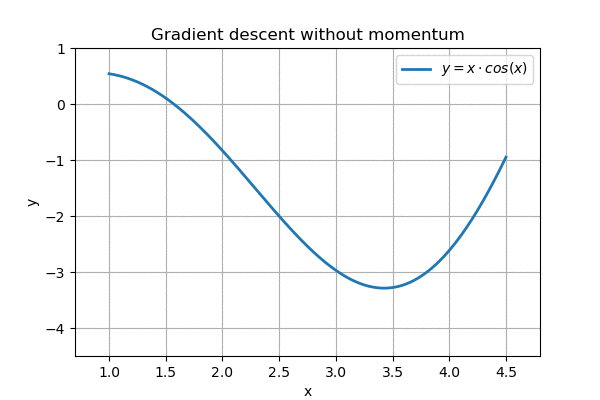
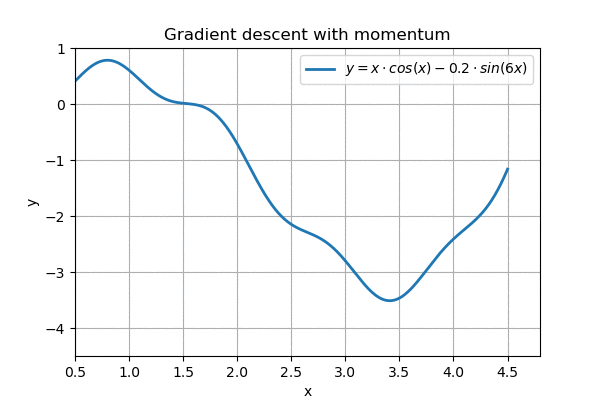
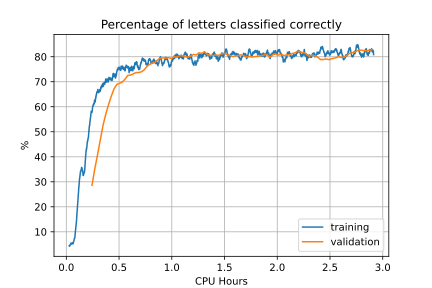
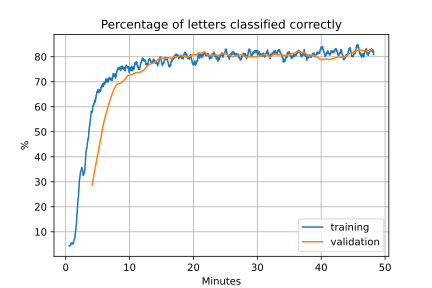
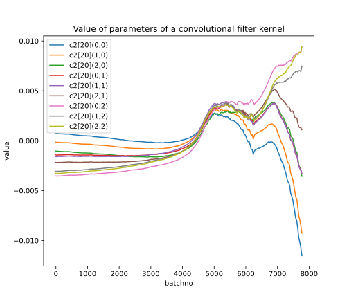

> This page is part of the [Hello Deep Learning](../hello-deep-learning) series of blog posts. You are very welcome to improve this page [via GitHub](https://github.com/berthubert/hello-dl-posts/blob/main/hyperparameters-inpection-adam/index.md)!

In [the previous chapter](../dl-convolutional) we successfully trained a network to recognize handwritten letters, but it took an awfully long time. This is not just inconvenient: networks that take too long to train mean we can experiment less. Some things really are out of reach if each iteration takes 24 hours, instead of 15 minutes. In addition we waste a lot of energy this way.

To speed things up, [we can make our calculations go faster, or we can do less of them](https://berthub.eu/articles/posts/optimizing-optimizing-400-percent-speedup/). Deep learning employs both techniques. 

On this page we will go through how deep learning networks speed up their operations. In addition we'll be taking a rare look inside networks to see how parameters are actually evolving.

# Parallelization
One way of speeding up calculations is by making more of them happen at the same time. In deep learning, it is very typical to evaluate batches of 64 inputs at a time. Instead of shoveling a series of 64 matrices one by one through our calculations, we could also use a library that can take a stack of 64 matrices, call this a "64-high tensor", and do the calculation all at once for the whole stack. This would be especially convenient if we had 64 parallel processing units available of course.

And it turns out that if you have the right kind of GPU, you do have such capacity.

In addition, modern CPUs have [SIMD](https://en.wikipedia.org/wiki/Single_instruction,_multiple_data) capabilities to perform certain calculations on 4, 8 or even 16 numbers at the same time. Also, most modern computers have multiple CPU cores available.

Because of this, it is nearly standard in professional neural network environments to do almost everything multidimensional tensors, as this offers your calculating backend as much opportunities as possible to use your CPU or GPU to perform many calculations in parallel. Some of the largest networks are even [distributed over multiple computers](https://pytorch.org/tutorials/beginner/dist_overview.html).

The reason this works so well is that we typically evaluate a whole batch of inputs while keeping the neural network parameters constant. This means all calculations can happen in parallel - they don't need to change any common data. The only thing that needs to happen sequentially is to gather all the gradients and apply them to the network. And then a new batch can be processed in parallel again.

# Being clever
A mainstay of neural networks is matrix multiplication. On the surface this would appear to be an \\(O(N^3)\\) process, scaling with the number of rows and columns of both matrices (where the number of columns in the second matrix is equal to the number of rows in the first). It turns out that through sufficient mathematical cleverness, [matrix multiplications can be performed a lot more efficiently](https://en.wikipedia.org/wiki/Computational_complexity_of_matrix_multiplication). In addition, if you truly understand what CPUs and caches are doing, you can speed things up even more.

As an example, an earlier version of the software behind these blog posts performed naive matrix multiplication. I finally gave up and moved to a professional matrix library ([Eigen](https://en.wikipedia.org/wiki/Eigen_(C%2B%2B_library))) and this delivered a 320-fold speedup immediately. In short, unless you really know what you are doing, you have no business implementing matrix multiplication yourself.

The software behind this series of posts benefits from SIMD vectorization because Eigen and compilers are able to make good use of parallel instructions. In addition, threads are used to just use more CPU cores.

# Doing less
Parallel and clever computations are nice since they allow us to do what we were doing already, but now faster. There are limits to this approach however - we can't keep on inventing faster math for example.

While training our networks, we are effectively trying out sets of parameters & calculating how the outcome would change if we adjusted our parameters, based on their derivatives (through automatic differentiation).

Above we described how we could perform such calculations faster, which means we can evaluate more sets of parameters per unit of time, which is nice.

A key component however can also be improved: making better use of those derivatives to improve our parameters more effectively.

In previous chapters we've trained our networks by adjusting each parameter by (say) 0.2 times the derivative of the loss function with respect to the parameter. This is the simplest possible approach, but it is not the best one. 

Learning by equally sized increments could be compared to climbing a hill taking tiny equally sized steps, where you know that if all previous steps have been upwards, you could probably get there a lot faster if you took larger steps.

Recall how we previously described 'hill climbing', where it worked pretty well:

<center>



<p></p>
</center>


However, on a more complex landscape, this regular gradient descent does not work so well:

<center>

  
*Nearly gets stuck around x=1.5, overshoots the goal*
<p></p>
</center>

We can see that the algorithm nearly gets stuck on the horizontal part around x=1.5. In addition, when it eventually reaches the goal, it ping-pongs around it, and never reaches the minimum.

A popular enhancement to this 'linear gradient descent' is to make it slightly more physical. For example, we could simulate a ball rolling down a hill, where the ball speeds up as it goes along, but also experiences friction:

<center>


<p></p>
</center>

This is called gradient descent with momentum, and it is pretty nice. Further enhancements are possible too, and most networks these days use [ADAM](https://machinelearningmastery.com/adam-optimization-from-scratch/), which not only implements momentum but also performs smoothing both on speed and on momentum. In addition, it cleverly initializes variables so the network "gets a running start". With judiciously picked parameters (\\(\alpha\\), \\(\beta_1\\) and \\(\beta_2\\)), [ADAM appears to be the best generic optimizer around](https://arxiv.org/abs/1412.6980).

As a case in point, recall how our pedestrian stochastic gradient descent took almost a whole day to learn how to read letters. Here is that same model on ADAM:

<center>


<p></p>
</center>

Within 1 CPU hour, [this code](https://github.com/berthubert/hello-dl/blob/main/tensor-convo-par.cc) was recognizing 80% of letters correctly. 

In addition, by benefiting from four-fold parallelization (since I have 4 cores), this code becomes even faster:

<center>


<p></p>
</center>

By achieving good performance after 15 wall clock minutes, we've increased our learning speed by over a factor of 80.

These things are not just nice, they are complete game changers. Networks that otherwise take days to reach decent performance can do so in hours with the right optimizer. Also, the optimizer can actually be achieve better results by not getting stuck in local minima. This brings us to a rather dark subject in deep learning.

# Hyperparameters
So far we've seen a number of parameters that had to be set: the learning rate, for which we suggested a value of 0.2. If we want to use momentum (the rolling ball method), we have to pick a *momentum* parameter. If we use ADAM, we need to pick \\(\alpha\\), \\(\beta_1\\) and \\(\beta_2\\) (although the default values are pretty good).

In addition there is the batch size. If we set this too low, the network jumps around too much. Too high and everything takes too long.

These important numbers are called *hyperparameters*, to distinguish them from the regular parameters that we are mutating within our neural network to make it learn things.

If you visit the many many demos of how easy machine learning is, you'll mostly see the hyperparameters just appearing there, with no explanation how they were derived. 

I can authoritatively tell you that very often these numbers came from days long experimentation. If you pick the numbers wrong, nothing (good) might happen, or at least not at any reasonable speed. Many demos are not honest about this, and if you change any of their carefully chosen numbers, you might find that the network no longer converges.

The *learning* part of machine learning is a lot harder than many demos make it out to be.

The actual design of the neural network layers is also considered part of the hyperparameter set. So if a network sorta arbitrarily consists of three convolutional layers with N channels in and M channels out, plus three fully connected linear combinations of x by y, know that these numbers were often gleaned from an earlier implementation, or were selected only after tedious "parameter sweeping".

So know that if you are ever building a novel network and it doesn't immediately perform like the many demos you saw, this is entirely normal and not your fault.

# Inspection
Neural networks tend to be pretty opaque, and this happens on two levels. From a theoretical standpoint, it is already hard to figure out how "a network does its thing". Much like in biology, it is not clear which neuron does what. We can sometimes "see" what is happening, as for example in our earliest 3-or-7 network. But it is hard work.

On a second level, if we have a ton of parameters all being trained, it is in a practical sense not that easy to get the numbers out to figure out what is going on.

For PyTorch, there are commercial platforms like [Weights & Biases](https://wandb.ai/) that can help create insight. But it turns out that with some simple measures we can also get a good look about what is going on.

For logging, we use [SQLiteWriter](https://berthub.eu/articles/posts/big-data-storage/), a tiny but pretty powerful logger that works like this:

```C++
SQLiteWriter sqw("convo-vals.sqlite3");

...
sqw.addValue({
  {"startID", startID}, {"batchno", batchno},
  {"epoch", 1.0*batchno*batch.size()/mn.num()}, 
  {"time", time(0)}, {"elapsed", time(0) - g_starttime},
  {"cputime", (double)clock()/CLOCKS_PER_SEC},
  {"corperc", perc}, {"avgloss", totalLoss/batch.size()},
  {"batchsize", (int)batch.size()}, {"lr", lr*batch.size()},
  {"momentum", momentum}}, "training");
```

This logs a modest amount of statistics to SQLite for every batch. The 'startID' is set when the program starts, which means that multiple runs of the software can log to the same SQLite database and we can distinguish what was logged by which invocation.

The other numbers mostly describe themselves, with `corperc` denoting the percentage of correct digit determinations (in this case). `lr` and `momentum` are also logged since these might change from run to run. All values end up in a table called `training`, there is a similar table called `validation` which stores the same numbers, but then for the validation set.

These numbers are nice to track our learning progress, but to really look inside we need to log a lot more. Recall how in the code samples so far we register the layers in our network:

```C++
State()
{
  this->d_members = {{&c1, "c1"}, {&c2, "c2"}, 
                     {&c3, "c3"}, {&fc1, "fc1"}, 
                     {&fc2, "fc2"}, {&fc3, "fc3"}};
}
```
Note that we also gave each layer a name. Our network does not itself need to know the names of layers, but it is great for logging. Each layer in the software knows how to log itself to the `SQLiteWriter` and we can make this happen like this:

```C++
ConvoAlphabetModel m;
ConvoAlphabetModel::State s;
..
if(batchno < 32 || !(tries%32)) {
  s.emit(sqw, startID, batchno, batch.size());
}
```

This logs the full model to the `SQLiteWriter` for the first 32 batches, and from then on once every 32 batches. Since models might have millions of parameters, we do need to think this through a bit.

Here is what comes out:
<center>

  
*Values of the kernel of the 20th filter of c2*

<p></p>
</center>

The [code to create this](https://github.com/berthubert/hello-dl/blob/main/hello-dl.ipynb) is relatively simple. First we retrieve the data:

```Python
engine = create_engine("sqlite:////home/ahu/git/hello-dl/convo-vals.sqlite3")
startIDs = pandas.read_sql_query("SELECT distinct(startID) as startID FROM data", engine)
startID=startIDs.startID.max()
```

And then select the data to plot:
```Python
fig, ax1 = plt.subplots(figsize=(7,6))

sel = pandas.read_sql_query(f"SELECT * FROM data where startID={startID} and name='c2' and 
            idx=20 and subname='filter' order by batchno", engine)
sel.set_index("batchno", inplace=True)
for c in sel.col.unique():
    for r in sel.row.unique():
        v = sel[(sel.row==r) & (sel.col==c)]
        ax1.plot(v.index, v.val - 1.0*v.val.mean(),
          label=v.name.unique()[0]+"["+str(v.idx.unique()[0])+"]("+str(r)+","+str(c)+")" )
ax1.legend(loc=2)
plt.title("Value of parameters of a convolutional filter kernel")
plt.xlabel("batchno")
plt.ylabel("value")
```

The `data` table has fields called `batchno`, `startID`, `name`, `idx`, `row`, `col`, `value` and `grad` that fully identify an element, and also store its current value and the gradient being used for SGD or ADAM.

# ADAM practicalities
The ADAM optimizer does require some infrastructure. To make things work, our `Tensor<T>` class now also has a struct storing the ADAM parameters:

```C++
  struct AdamVals
  {
    EigenMatrix m;
    EigenMatrix v;
  } d_adamval;
```

These stand for the momentum and velocity of "the ball" if you will.

[Our code](https://github.com/berthubert/hello-dl/blob/main/tensor-convo-par.cc#L259) has meanwhile grown an option parser so we can select an optimizer at will:

```C++
if(program.get<bool>("--adam"))
  s.learnAdam(1.0/batch.size(), batchno, program.get<double>("--alpha"));
else
  s.learn(lr, momentum);
```

The mechanics of `learnAdam` can be found in [tensor-layers.hh](https://github.com/berthubert/hello-dl/blob/main/tensor-layers.hh#L27).

# Parallelization
As noted, we can evaluate a whole batch in parallel, since the network parameters stay constant during evaluation. We do however have to gather all the gradients from the individual evaluations and add them up.

As is the case always, **speeding things up by parallelizing them does not make your code any more readable**. This is especially painful for an educational project like this one. I've tried hard to keep it as simple as possible. The 4- or 8-fold speedup you can achieve with this technique is important enough to warrant its use. There is a huge difference between 30 minutes of training or 4 hours.

One of the simplest ways to make sure that things actually get faster with multiple threads is to use a '[shared nothing architecture](https://en.wikipedia.org/wiki/Shared-nothing_architecture)', and this is what we do for our project.

We launch a number of threads that each have a complete copy of the model we are training. These then process individual images/samples from a batch, and record the gradients. 

Once all threads are done, the gradients are gathered together, and then the `main()` thread copy of the model performs the learning. The new parameters are then broadcast to the thread copies again, and then the next batch is processed.

Sadly, despite my best efforts, the code in [tensor-convo-par.cc](https://github.com/berthubert/hello-dl/blob/main/tensor-convo-par.cc) has a hundred lines of thread handling to make this all possible. 

# Next up
We started our quest for robust character recognition, but found that it was learning only very slowly. In this chapter we looked into various optimizers and found that ADAM converged 20 times faster. [In the next chapter](../dropout-data-augmentation-weight-decay), we are going to check if our network is actually robust, and what we can do to make it so.
